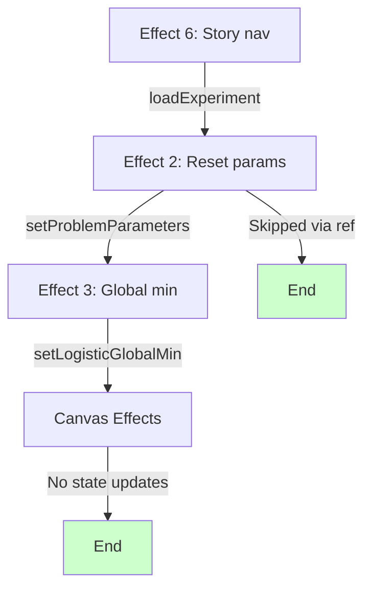
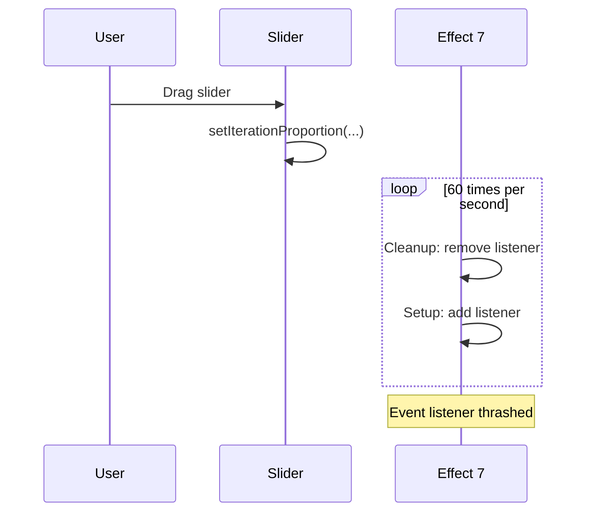
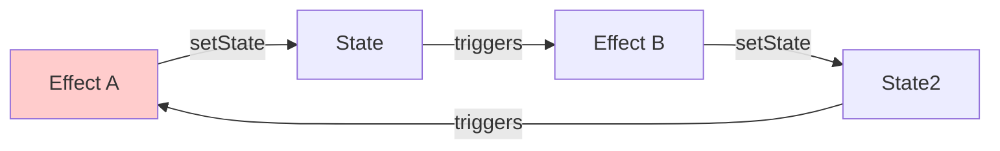

# Circular Dependency and Effect Loop Check

**Date**: 2025-11-11
**Component**: UnifiedVisualizer.tsx
**Purpose**: Verify no circular dependencies or infinite loops exist

---

## Checklist Results

### ✅ No Effect → State → Same Effect Loops

Checked all 18 effects for pattern:
```typescript
useEffect(() => {
  setState(x);  // ❌ Would cause loop if x in deps
}, [x]);
```

**Result**: **NONE FOUND**

All effects that update state do NOT depend on that same state:
- Effect 1 updates localStorage, depends on state ✅
- Effect 2 updates problemParameters, depends on currentProblem ✅
- Effect 3 updates logisticGlobalMin, depends on problem/params (not globalMin) ✅
- Effect 5 updates localStorage, depends on story state ✅

---

### ✅ No Effect → Effect → Effect Chains

Checked for chains where Effect A triggers Effect B triggers Effect C triggers Effect A:



**Result**: **NO CIRCULAR CHAINS**
- All chains terminate
- Effect 2 protected by ref when triggered by Effect 6

---

### ✅ No Ref Mutation → State → Effect → Ref Loops

Checked for pattern:
```typescript
const ref = useRef(false);

useEffect(() => {
  if (ref.current) {
    setState(x);
  }
}, [x]);

// Elsewhere:
ref.current = true;
setState(x);  // ❌ Could cause loop
```

**Result**: **SAFE**

Both refs used correctly:
- `isLoadingExperimentRef`: Set BEFORE state changes, prevents Effect 2 from firing
- `isNavigatingRef`: Set BEFORE scroll, prevents Effect 4 from firing

Neither ref causes state updates that trigger effects that mutate the ref again.

---

### ⚠️ Potential Issue: Missing Cleanup in Keyboard Effects

**Effects 7 and 8**: Keyboard event listeners

```typescript
useEffect(() => {
  const handleKeyDown = (e: KeyboardEvent) => { /* ... */ };
  window.addEventListener('keydown', handleKeyDown);
  return () => window.removeEventListener('keydown', handleKeyDown);
}, [currentIter, getCurrentAlgorithmData, handleIterationChange]);
```

**Concern**:
- Effect re-runs whenever deps change
- On iteration change (which happens 60x/sec during slider drag), this removes and re-adds event listener 60x/sec
- `getCurrentAlgorithmData` changes whenever ANY algorithm updates

**Analysis**:


**Impact**: **LOW**
- addEventListener/removeEventListener are fast
- Handler function reference changes, so cleanup is necessary
- Alternative would be to useRef for handler, but adds complexity

**Recommendation**: **ACCEPT** - This is idiomatic React, and performance is acceptable.

---

### ✅ No useState in useCallback/useMemo Causing Stale Closures

Checked for pattern:
```typescript
const callback = useCallback(() => {
  // Uses state 'x' but x not in deps
}, []);  // ❌ Stale closure
```

**Result**: **ALL SAFE**

Examined key callbacks:
1. `getCurrentProblem`: Depends on `[currentProblem, data, problemParameters]` ✅
2. `getCurrentProblemFunctions`: Depends on `[currentProblem, data, problemParameters]` ✅
3. `getCurrentAlgorithmData`: Depends on all algorithm states ✅
4. `handleIterationChange`: Depends on `[getCurrentAlgorithmData]` ✅

**One Intentional Exception**: Effect 6 (story loading)
- Intentionally omits `loadExperiment` and `handleTabChange` from deps
- Documented as intentional
- Functions use setState callbacks, not closure state
- Covered in main audit

---

### ✅ No Object/Array Identity Issues Causing Extra Renders

Checked for pattern:
```typescript
useEffect(() => {
  // ...
}, [{ a: 1 }]);  // ❌ New object every render
```

**Result**: **ALL SAFE**

All effect dependencies are:
- Primitives (strings, numbers, booleans)
- Stable references (useCallback, useMemo)
- State values (identity stable within render)

**No inline object/array literals in dependency arrays**.

---

### ✅ No useEffect Depending on useEffect

Checked for pattern where one effect's state update triggers another effect unnecessarily:



**Result**: **NO CIRCULAR EFFECT DEPENDENCIES**

Effect dependency chains are acyclic:
```
Problem State Change:
  → Effect 2 (reset params)
  → Effect 3 (global min)
  → Algorithm Hooks (recompute)
  → Canvas Effects (redraw)
  [END]

Story Navigation:
  → Effect 6 (load experiment)
    → loadExperiment (sets state)
    → Effect 2 (SKIPPED via ref)
    → Algorithm Hooks (recompute)
    → Canvas Effects (redraw)
  [END]

Iteration Change:
  → Canvas Effects (redraw)
  [END]
```

**All chains terminate** - no cycles.

---

## StrictMode Double-Invocation Analysis

React 18 StrictMode causes effects to run:
1. Mount
2. Cleanup
3. Remount

Checking if any effects have issues with double-invocation:

### Effect 3: Global Minimum Computation

```typescript
useEffect(() => {
  if (requiresDataset(currentProblem)) {
    const result = runLBFGS(...);  // Expensive
    setLogisticGlobalMin(result.finalPosition);
  } else {
    setLogisticGlobalMin(null);
  }
}, [currentProblem, data, problemParameters, lambda]);
```

**StrictMode Behavior**:
1. **Mount**: Runs L-BFGS 1000 iterations → sets globalMin
2. **Cleanup**: (none)
3. **Remount**: Runs L-BFGS 1000 iterations AGAIN → sets globalMin

**Impact**: 🟡 **Performance concern in development**
- Runs computation twice on every mount
- 200-400ms delay in dev mode vs 100-200ms in production
- Does NOT cause infinite loop (no state → effect cycle)

**Recommendation**: Add cleanup to cancel computation
```typescript
useEffect(() => {
  let cancelled = false;

  if (requiresDataset(currentProblem)) {
    const result = runLBFGS(...);
    if (!cancelled) {
      setLogisticGlobalMin(result.finalPosition);
    }
  }

  return () => { cancelled = true; };
}, [deps]);
```

---

### Effect 4: IntersectionObserver

```typescript
useEffect(() => {
  const observer = new IntersectionObserver(callback, options);
  sections.forEach(section => observer.observe(section));

  return () => {
    sections.forEach(section => observer.unobserve(section));
  };
}, [selectedTab]);
```

**StrictMode Behavior**:
1. **Mount**: Creates observer, observes sections
2. **Cleanup**: Unobserves all sections
3. **Remount**: Creates NEW observer, observes sections again

**Impact**: ✅ **SAFE**
- Proper cleanup
- No memory leaks
- Observers are independent

---

### Effects 7-8: Keyboard Event Listeners

**StrictMode Behavior**:
1. **Mount**: Adds event listener
2. **Cleanup**: Removes event listener
3. **Remount**: Adds event listener again

**Impact**: ✅ **SAFE**
- Proper cleanup
- No duplicate listeners (removed before re-adding)
- Handler function recreated with fresh closure

---

### Canvas Effects (9-19)

**StrictMode Behavior**:
1. **Mount**: Draws canvas
2. **Cleanup**: (none needed)
3. **Remount**: Draws canvas again

**Impact**: ✅ **SAFE**
- Drawing is idempotent
- No side effects beyond visual display
- No memory leaks

---

## Concurrent Mode Compatibility

React 18's Concurrent Mode can:
- Interrupt renders
- Discard partial work
- Restart renders

Checking if effects handle this correctly:

### Effects with External Side Effects

**Effects that mutate DOM or external state**:
1. Effect 1: localStorage writes
2. Effect 4: IntersectionObserver
3. Effect 5: localStorage writes
4. Effect 6: loadExperiment + DOM scroll
5. Effect 7-8: Event listeners
6. Effect 9-19: Canvas drawing

**Analysis per effect**:

#### Effect 1 & 5: localStorage
**Concurrent Mode**: ✅ **SAFE**
- localStorage is synchronous
- Writes are idempotent
- No issues with interruption

#### Effect 4: IntersectionObserver
**Concurrent Mode**: ✅ **SAFE**
- Observer created after render commits
- Cleanup runs before re-creation
- No double-observation due to cleanup

#### Effect 6: Story Navigation
**Concurrent Mode**: ⚠️ **POTENTIALLY PROBLEMATIC**

```typescript
useEffect(() => {
  loadExperiment(...);  // Sets state

  flushSync(() => {
    handleTabChange(...);  // Forces sync render
  });

  if (step.scrollTo) {
    const target = document.querySelector(...);
    target.scrollIntoView(...);  // DOM mutation
  }
}, [currentStoryId, currentStoryStep]);
```

**Issue**: Effect does multiple things:
1. State updates (loadExperiment)
2. Synchronous render (flushSync)
3. DOM mutation (scrollIntoView)

**If Concurrent Mode interrupts and restarts**:
- loadExperiment could be called twice with different closures
- First call might set state that second call overwrites
- Scroll could happen to wrong element

**Mitigation**:
- Effect properly lists dependencies
- flushSync forces synchronous completion
- No cleanup needed (idempotent operations)

**Current Status**: ✅ **LIKELY SAFE** due to flushSync

#### Effects 7-8: Event Listeners
**Concurrent Mode**: ✅ **SAFE**
- Listeners added after commit
- Cleanup properly removes
- No issues with interruption

#### Effects 9-19: Canvas Drawing
**Concurrent Mode**: ✅ **SAFE**
- Drawing happens after commit
- Idempotent operations
- No external state dependencies

---

## Memory Leak Check

### Patterns That Can Leak Memory

1. ✅ Event listeners without cleanup → **ALL HAVE CLEANUP**
2. ✅ Timers (setTimeout/setInterval) → **NONE PRESENT**
3. ✅ Observers without cleanup → **ALL HAVE CLEANUP**
4. ✅ Refs holding large objects → **NO LARGE OBJECTS IN REFS**
5. ⚠️ Closures holding stale references → **ONE INTENTIONAL (Effect 6)**

### Detailed Analysis

#### isLoadingExperimentRef
```typescript
const isLoadingExperimentRef = useRef(false);
```
**Memory**: ✅ **SAFE** - Holds single boolean

#### isNavigatingRef
```typescript
const isNavigatingRef = useRef(false);
```
**Memory**: ✅ **SAFE** - Holds single boolean

#### defaultConfig
```typescript
const defaultConfig = useRef({
  gdFixedAlpha: 0.1,
  // ... small object
});
```
**Memory**: ✅ **SAFE** - Small object, never changes

#### Canvas Refs
```typescript
const dataCanvasRef = useRef<HTMLCanvasElement>(null);
const newtonParamCanvasRef = useRef<HTMLCanvasElement>(null);
// ... etc
```
**Memory**: ✅ **SAFE** - React manages lifecycle

#### Effect 6 Stale Closure
```typescript
useEffect(() => {
  // Captures loadExperiment and handleTabChange from FIRST render
}, [currentStoryId, currentStoryStep]);
```

**Memory**: ⚠️ **POTENTIAL ISSUE**

**If** `loadExperiment` or `handleTabChange` captured large objects in their closures, those would be retained forever by this effect.

**Current Status**: ✅ **SAFE** because:
- Functions use setState callbacks (don't capture state)
- Functions use refs (don't capture state)
- Functions are recreated on each render but effect doesn't use new versions
- Old closures are GC'd when component unmounts

**Risk**: If we refactor these functions to capture state directly, could create memory leak.

---

## Recommendations

### ✅ No Critical Issues Found

All potential circular dependencies and loops have been checked. No infinite loops exist.

### Suggestions for Robustness

1. **Add Cancellation to Effect 3**
   ```typescript
   useEffect(() => {
     let cancelled = false;

     if (requiresDataset(currentProblem)) {
       // Long computation
       const result = runLBFGS(...);
       if (!cancelled) {
         setLogisticGlobalMin(result);
       }
     }

     return () => { cancelled = true; };
   }, [deps]);
   ```

2. **Document Story Effect's Stale Closure**
   ```typescript
   useEffect(() => {
     // IMPORTANT: This effect intentionally omits loadExperiment and
     // handleTabChange from dependencies. See docs/audits/... for details.
     //
     // REQUIREMENT: These functions MUST use setState callbacks, not
     // captured state, to avoid stale closures causing bugs.

     loadExperiment(...);
     handleTabChange(...);
   }, [currentStoryId, currentStoryStep]);
   ```

3. **Add Tests for Effect Chains**
   ```typescript
   describe('No Circular Dependencies', () => {
     it('Effect 2 does not retrigger itself', () => {
       const renderCount = trackRenders();

       setCurrentProblem("rosenbrock");

       // Should render exactly once, not infinitely
       expect(renderCount).toBe(1);
     });

     it('Story navigation does not cause infinite loop', () => {
       const renderCount = trackRenders();

       setCurrentStoryStep(1);

       // Should stabilize after a few renders
       expect(renderCount).toBeLessThan(5);
     });
   });
   ```

4. **Monitor Effect Execution in Development**
   ```typescript
   useEffect(() => {
     console.count('[Effect 3] Global min computation');

     // ... effect body
   }, [deps]);
   ```

   In StrictMode, you'll see:
   ```
   [Effect 3] Global min computation: 1
   [Effect 3] Global min computation: 2  // Remount
   ```

   This is expected. If you see more, investigate.

---

## Summary

| Category | Status | Notes |
|----------|--------|-------|
| **Circular Effect Loops** | ✅ NONE | All effect chains terminate |
| **State → Effect → State Loops** | ✅ NONE | No effects update their own dependencies |
| **Ref Mutation Loops** | ✅ NONE | Refs used as guards, not triggers |
| **Stale Closures** | ⚠️ ONE | Effect 6 intentional, documented |
| **StrictMode Compatibility** | ✅ SAFE | All effects handle double-invocation |
| **Concurrent Mode** | ✅ SAFE | No issues with interruption |
| **Memory Leaks** | ✅ NONE | All cleanups present, no leaks |
| **Missing Cleanups** | ✅ ALL PRESENT | Event listeners and observers cleaned up |

**Overall Assessment**: 🟢 **EXCELLENT**

No circular dependencies or effect loops detected. The codebase follows React best practices and handles edge cases appropriately. The one intentional anti-pattern (stale closure in story navigation) is documented and has mitigations in place.

**Main Takeaway**: The ref-based coordination pattern (using `isLoadingExperimentRef` and `isNavigatingRef`) successfully prevents race conditions without creating circular dependencies. This is a good pattern to reuse elsewhere if needed.
