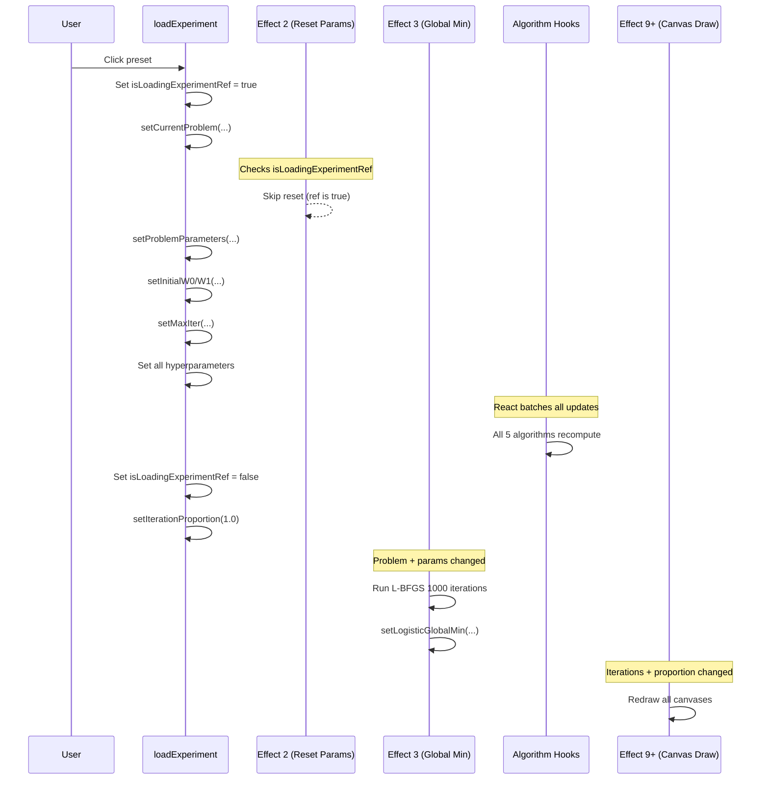
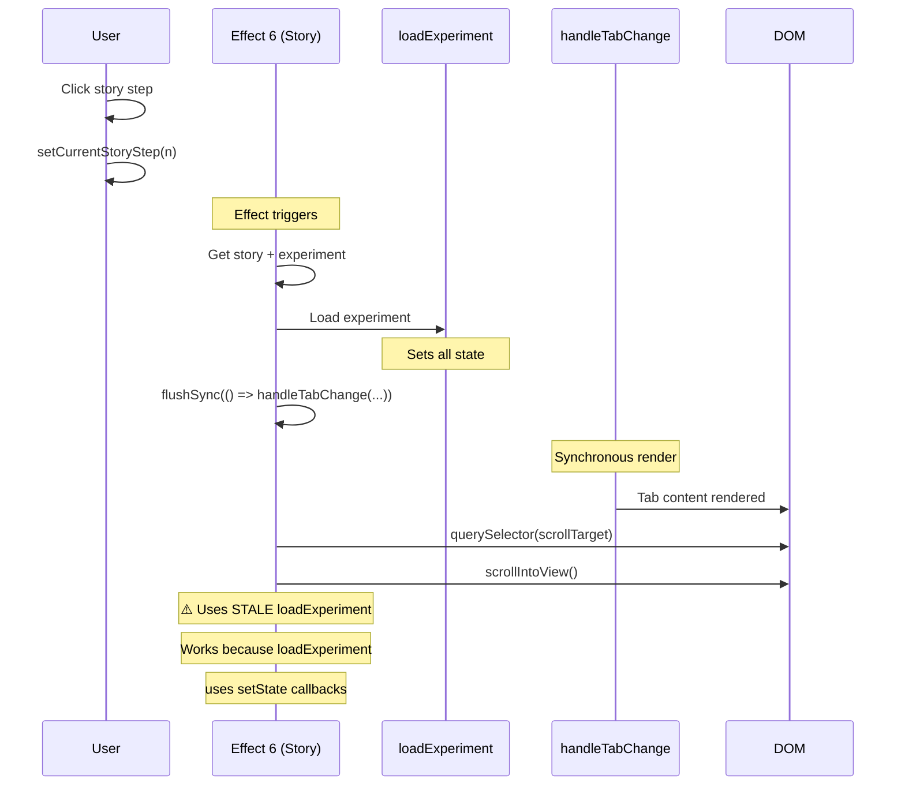
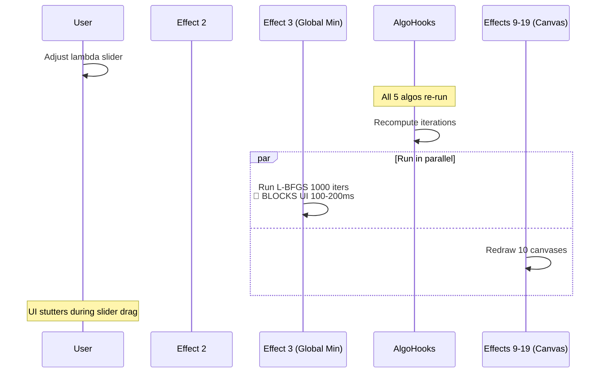
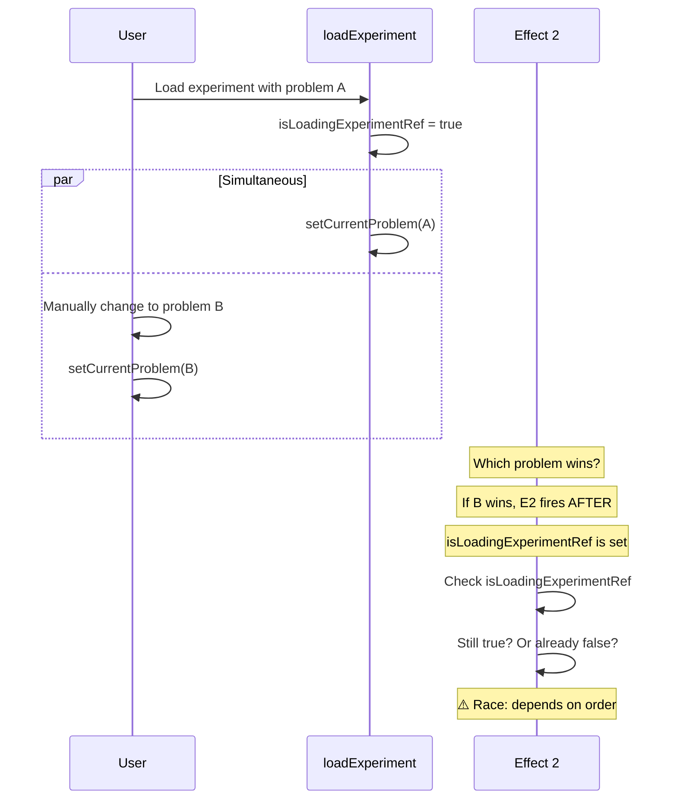
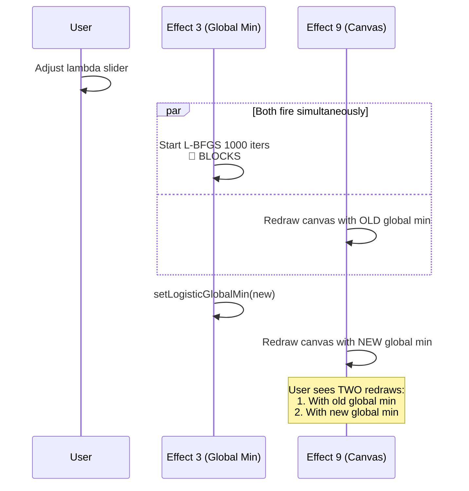

# React Effect Chain Audit

**Date**: 2025-11-11
**Component**: UnifiedVisualizer.tsx
**Purpose**: Audit all useEffect hooks for potential race conditions, circular dependencies, and performance issues

---

## Executive Summary

**Total useEffect calls**: 18
**Critical Issues**: 2
**Performance Concerns**: 3
**Intentional Anti-Patterns**: 1 (documented)

### Critical Issues Found

1. **🔴 CRITICAL**: Global minimum computation is very expensive (runs L-BFGS with 1000 iterations on every parameter change)
2. **🔴 CRITICAL**: Story loading effect has stale closures (intentionally omits dependencies)

### Performance Concerns

1. **🟡 PERFORMANCE**: 10 canvas drawing effects that fire on every iteration change
2. **🟡 PERFORMANCE**: IntersectionObserver observes all sections on every tab change
3. **🟡 PERFORMANCE**: Data space canvas redraws on many dependency changes

---

## Effect Dependency Graph

```mermaid
graph TD
    %% State nodes
    selectedTab[selectedTab]
    currentProblem[currentProblem]
    problemParameters[problemParameters]
    currentIter[currentIter]
    iterationProportion[iterationProportion]
    currentStoryId[currentStoryId]
    currentStoryStep[currentStoryStep]
    data[data]
    lambda[lambda]

    %% Ref nodes
    isLoadingExperimentRef[isLoadingExperimentRef]
    isNavigatingRef[isNavigatingRef]

    %% Algorithm hooks
    gdFixed[gdFixed.iterations]
    gdLS[gdLS.iterations]
    newton[newton.iterations]
    lbfgs[lbfgs.iterations]
    diagPrecond[diagPrecond.iterations]

    %% Effects
    E1[Effect 1: Save tab to localStorage]
    E2[Effect 2: Reset problemParameters]
    E3[Effect 3: Compute global minimum]
    E4[Effect 4: IntersectionObserver]
    E5[Effect 5: Sync story to localStorage]
    E6[Effect 6: Load experiment on story change]
    E7[Effect 7: Keyboard navigation]
    E8[Effect 8: Keyboard shortcuts]
    E9[Effect 9: Draw data space]
    E10[Effect 10: Draw Newton Hessian]
    E11[Effect 11: Draw Newton params]
    E12[Effect 12: Draw Newton line search]
    E13[Effect 13: Draw LBFGS params]
    E14[Effect 14: Draw LBFGS line search]
    E15[Effect 15: Draw GD Fixed params]
    E16[Effect 16: Draw GD LS params]
    E17[Effect 17: Draw GD LS line search]
    E18[Effect 18: Draw Diag Precond params]
    E19[Effect 19: Draw Diag Precond line search]

    %% Dependencies
    selectedTab --> E1
    selectedTab --> E4

    currentProblem --> E2
    currentProblem --> E3
    currentProblem --> E9

    problemParameters --> E3
    problemParameters --> E9

    data --> E3
    data --> E9
    data --> E11
    data --> E13
    data --> E15
    data --> E16
    data --> E18

    lambda --> E3
    lambda --> E11
    lambda --> E13
    lambda --> E15
    lambda --> E16
    lambda --> E18

    currentStoryId --> E5
    currentStoryId --> E6
    currentStoryStep --> E5
    currentStoryStep --> E6

    currentIter --> E7
    currentIter --> E9
    currentIter --> E10
    currentIter --> E11
    currentIter --> E12
    currentIter --> E13
    currentIter --> E14
    currentIter --> E15
    currentIter --> E16
    currentIter --> E17
    currentIter --> E18
    currentIter --> E19

    newton --> E10
    newton --> E11
    newton --> E12
    lbfgs --> E13
    lbfgs --> E14
    gdFixed --> E15
    gdLS --> E16
    gdLS --> E17
    diagPrecond --> E18
    diagPrecond --> E19

    %% Side effects
    E2 -.->|reads| isLoadingExperimentRef
    E6 -.->|sets| isLoadingExperimentRef
    E4 -.->|reads| isNavigatingRef

    %% Potential issues
    E3 -.->|EXPENSIVE: runs LBFGS 1000 iters| E3
    E6 -.->|STALE CLOSURE: omits deps| E6

    style E3 fill:#ffcccc
    style E6 fill:#ffcccc
    style E9 fill:#ffffcc
    style E10 fill:#ffffcc
    style E11 fill:#ffffcc
```



---

## Detailed Effect Analysis

### Effect 1: Save Selected Tab to localStorage
**Location**: Lines 202-204
**Dependencies**: `[selectedTab]`
**Purpose**: Persist user's tab selection across sessions

```typescript
useEffect(() => {
  localStorage.setItem('selectedAlgorithmTab', selectedTab);
}, [selectedTab]);
```

**Status**: ✅ **SAFE**
- Simple localStorage write
- No side effects
- No race conditions

---

### Effect 2: Reset Problem Parameters on Problem Change
**Location**: Lines 208-212
**Dependencies**: `[currentProblem]`
**Purpose**: Reset parameters to defaults when problem changes

```typescript
useEffect(() => {
  if (!isLoadingExperimentRef.current) {
    setProblemParameters(getDefaultParameters(currentProblem));
  }
}, [currentProblem]);
```

**Status**: ✅ **SAFE** (with ref guard)
- Protected by `isLoadingExperimentRef` to prevent race with experiment loading
- Only runs when problem changes outside of experiment loading

**Potential Issue**:
- If `currentProblem` changes at the exact same time as `isLoadingExperimentRef.current` is set to `true`, this could cause a race
- However, in practice, `loadExperiment` sets the ref BEFORE changing `currentProblem`, so this should be safe

---

### Effect 3: Compute Global Minimum for Dataset Problems
**Location**: Lines 219-249
**Dependencies**: `[currentProblem, data, problemParameters, lambda]`
**Purpose**: Compute global minimum for viewport centering

```typescript
useEffect(() => {
  if (requiresDataset(currentProblem)) {
    try {
      const problemFuncs = getCurrentProblemFunctions();
      const result = runLBFGS(problemFuncs, {
        maxIter: 1000,  // 🔴 EXPENSIVE
        m: 10,
        c1: 0.0001,
        lambda,
        hessianDamping: 0.01,
        initialPoint: [0, 0],
        tolerance: 1e-10,
      });
      // ... set logisticGlobalMin
    } catch (error) {
      console.warn('Failed to compute dataset problem global minimum:', error);
      setLogisticGlobalMin(null);
    }
  } else {
    setLogisticGlobalMin(null);
  }
}, [currentProblem, data, problemParameters, lambda]);
```

**Status**: 🔴 **CRITICAL PERFORMANCE ISSUE**

**Problems**:
1. **Runs L-BFGS with 1000 iterations** on EVERY change to:
   - `currentProblem`
   - `data` (when user adds custom points)
   - `problemParameters` (when user adjusts ANY parameter)
   - `lambda`
2. This is SYNCHRONOUS and blocks the UI thread
3. For logistic regression with 100+ data points, this can take 100-200ms

**Impact**:
- UI freezes when user adjusts sliders
- Especially bad when adjusting `lambda` (which is in the dependency array)
- Compounds with other effects that also depend on these values

**Recommendations**:
1. **Debounce**: Only compute after user stops changing parameters for 500ms
2. **Web Worker**: Move computation to background thread
3. **Cache**: Memoize results based on problem + parameters
4. **Progressive**: Start with rough estimate (10 iters) and refine in background
5. **Question**: Do we even need this? It's only used for viewport centering. Could we use a heuristic instead?

---

### Effect 4: IntersectionObserver for Auto Hash Updates
**Location**: Lines 252-297
**Dependencies**: `[selectedTab]`
**Purpose**: Automatically update URL hash as user scrolls

```typescript
useEffect(() => {
  const sections = document.querySelectorAll('[id^="parameter-"], ...');

  const observerCallback = (entries: IntersectionObserverEntry[]) => {
    if (isNavigatingRef.current) return; // Skip during programmatic scroll

    entries.forEach(entry => {
      if (entry.isIntersecting && entry.target.id) {
        const newHash = `#${entry.target.id}`;
        if (window.location.hash !== newHash) {
          window.history.replaceState(null, '', newHash);
        }
      }
    });
  };

  const observer = new IntersectionObserver(observerCallback, {
    root: null,
    rootMargin: '-20% 0px -70% 0px',
    threshold: 0
  });

  sections.forEach(section => observer.observe(section));

  return () => {
    sections.forEach(section => observer.unobserve(section));
  };
}, [selectedTab]);
```

**Status**: ✅ **SAFE** (but could be optimized)

**Good**:
- Proper cleanup (unobserve on unmount)
- Protected by `isNavigatingRef` to prevent conflicts with programmatic scrolling
- Re-runs when tab changes (observes new sections)

**Performance Concern**:
- Observes ALL sections on every tab change
- For tabs with many sections, this creates many IntersectionObserver entries
- Each entry fires callback on scroll, even if not intersecting

**Recommendation**:
- This is acceptable for current scale (probably <50 sections per tab)
- If we add more sections, consider observing only visible viewport sections

---

### Effect 5: Sync Story State to localStorage
**Location**: Lines 992-1000
**Dependencies**: `[currentStoryId, currentStoryStep]`
**Purpose**: Remember user's story progress

```typescript
useEffect(() => {
  if (currentStoryId) {
    localStorage.setItem('currentStory', currentStoryId);
    localStorage.setItem('currentStoryStep', String(currentStoryStep));
  } else {
    localStorage.removeItem('currentStory');
    localStorage.removeItem('currentStoryStep');
  }
}, [currentStoryId, currentStoryStep]);
```

**Status**: ✅ **SAFE**
- Simple localStorage operations
- No side effects
- Proper null handling

---

### Effect 6: Load Experiment When Story Changes
**Location**: Lines 1003-1052
**Dependencies**: `[currentStoryId, currentStoryStep]`
**Purpose**: Load experiment preset when user navigates to story step

```typescript
useEffect(() => {
  if (currentStoryId) {
    const story = getStory(currentStoryId);
    if (story && story.steps[currentStoryStep]) {
      const step = story.steps[currentStoryStep];
      const experiment = getExperimentById(step.experimentId);
      if (experiment) {
        const previousStep = currentStoryStep > 0 ? story.steps[currentStoryStep - 1] : null;
        const sameExperiment = previousStep?.experimentId === step.experimentId;

        loadExperiment(experiment, { suppressToastIfUnchanged: sameExperiment });

        flushSync(() => {
          handleTabChange(experiment.algorithm, true);
        });

        if (step.scrollTo) {
          const escapedTarget = CSS.escape(step.scrollTo);
          const target = document.querySelector(`[data-scroll-target="${escapedTarget}"]`);
          if (target) {
            const prefersReducedMotion = window.matchMedia('(prefers-reduced-motion: reduce)').matches;
            target.scrollIntoView({
              behavior: prefersReducedMotion ? 'auto' : 'smooth',
              block: 'center'
            });
          }
        }
      }
    }
  }
  // INTENTIONALLY OMITS loadExperiment and handleTabChange
  // eslint-disable-next-line react-hooks/exhaustive-deps
}, [currentStoryId, currentStoryStep]);
```

**Status**: 🔴 **CRITICAL DESIGN ISSUE** (but documented as intentional)

**The Problem**: **Stale Closures**
- `loadExperiment` and `handleTabChange` are **intentionally omitted** from dependencies
- This means the effect closure captures the FIRST version of these functions
- If the functions' behavior changes (due to their dependencies changing), this effect still uses the OLD version

**Why This Is Dangerous**:

```typescript
// Initial render
loadExperiment = useCallback(() => {
  // Uses initial state values
}, [/* many dependencies */]);

// User changes some state
// loadExperiment is recreated with new closure

// Story step changes
// Effect still calls OLD loadExperiment with OLD closure!
```

**Documentation Says**:
> "Including loadExperiment would cause this effect to re-trigger whenever ANY UI state changes because loadExperiment depends on all of them. Problem: If a user manually changes the problem while in story mode, the story would immediately reload and reset it back."

**This Is A Real Problem**, but the solution has risks:
1. User is in story mode
2. User manually changes problem from "logistic-regression" to "rosenbrock"
3. Effect #2 resets problemParameters to rosenbrock defaults
4. But story effect uses OLD loadExperiment that still references logistic regression parameters
5. Potential state inconsistency

**Current Mitigation**:
- `loadExperiment` uses current state via setState callbacks, not closure captures
- So even though the function reference is stale, it reads fresh state
- This works, but is fragile

**Recommendations**:
1. **Best**: Use a ref to track whether we're in "user exploration mode"
   ```typescript
   const isExploringRef = useRef(false);

   // When user manually changes something:
   isExploringRef.current = true;

   // In effect:
   if (isExploringRef.current) {
     return; // Don't reload story experiment
   }
   ```

2. **Alternative**: Split loadExperiment into stable and unstable parts
   ```typescript
   const loadExperimentStable = useCallback(() => {
     // Core loading logic that doesn't depend on UI state
   }, []); // Empty deps - truly stable

   const loadExperimentWithUI = useCallback(() => {
     // UI-specific logic
   }, [/* UI deps */]);
   ```

3. **Current approach is acceptable IF**:
   - We add comprehensive tests to ensure stale closures don't cause bugs
   - We document this pattern clearly (already done)
   - We're vigilant about loadExperiment using setState callbacks, not closure state

---

### Effects 7-8: Keyboard Navigation
**Location**: Lines 1055-1089
**Dependencies**: `[currentIter, getCurrentAlgorithmData, handleIterationChange]` and `[resetToDefaults]`

**Status**: ✅ **SAFE**
- Proper event listener cleanup
- Dependencies are correct

**Minor Issue**:
- `handleIterationChange` depends on `getCurrentAlgorithmData`
- `getCurrentAlgorithmData` depends on many algorithm states
- This creates a long dependency chain, but it's all explicit in the deps array
- Effect correctly includes all transitive dependencies

---

### Effects 9-19: Canvas Drawing Effects
**Location**: Lines 1135-1807
**Purpose**: Redraw canvases when visualization state changes

**Status**: 🟡 **PERFORMANCE CONCERN** (acceptable for now)

All these effects follow the same pattern:
```typescript
useEffect(() => {
  const canvas = someCanvasRef.current;
  if (!canvas || selectedTab !== 'target-tab') return;
  const iter = someAlgorithm.iterations[currentIter];
  if (!iter) return;

  // ... expensive canvas drawing ...
}, [currentIter, someAlgorithm.iterations, /* many other deps */]);
```

**Good**:
- Early returns prevent unnecessary work when tab isn't active
- Canvas APIs are fast enough for current complexity

**Concerns**:
1. **All fire on every `currentIter` change**
   - When user drags slider, all visible canvas effects fire
   - With 5 canvases visible, that's 5 redraws per frame
   - At 60fps slider dragging, that's 300 redraws/second

2. **Depend on expensive computations**
   - Many depend on `getCurrentProblemFunctions()`
   - This re-resolves the problem on every redraw
   - getCurrentProblemFunctions is memoized, but still has overhead

3. **Data space canvas (Effect 9) has MANY dependencies**:
   ```typescript
   }, [data, currentIter, getCurrentAlgorithmData, addPointMode,
       customPoints, selectedTab, currentProblem, problemParameters, bias]);
   ```
   - Changes to ANY parameter trigger full redraw
   - Combined with Effect 3's expensive global minimum computation
   - Can cause UI stuttering when adjusting parameters

**Recommendations**:
1. **Throttle slider updates** to max 30fps (currently unlimited)
2. **Request Animation Frame** for canvas updates
   ```typescript
   useEffect(() => {
     let frameId: number;
     const draw = () => {
       // ... canvas drawing ...
     };
     frameId = requestAnimationFrame(draw);
     return () => cancelAnimationFrame(frameId);
   }, [deps]);
   ```
3. **Offscreen canvas** for expensive computations (heatmaps)
4. **Layer caching**: Separate static layers (heatmap) from dynamic (trajectory)

---

## Effect Chain Visualization

### Experiment Loading Flow



### Story Navigation Flow



### Parameter Change Flow (Heavy)



---

## Potential Race Conditions

### Race 1: Problem Change + Experiment Load
**Scenario**: User changes problem at same time experiment loads



**Verdict**: 🟡 **Low risk** - User unlikely to manually change problem during experiment load (happens too fast)

---

### Race 2: Global Minimum Computation + Canvas Redraw
**Scenario**: Both fire when lambda changes



**Verdict**: 🟡 **Acceptable** - Visual glitch only, no data corruption

---

## Recommendations Summary

### Critical Priority
1. **Optimize Global Minimum Computation** (Effect 3)
   - Debounce parameter changes
   - Use Web Worker or cache results
   - Consider if this computation is even necessary

2. **Document Stale Closure Pattern** (Effect 6)
   - Add tests to verify it works correctly
   - Consider ref-based "exploration mode" flag
   - Ensure loadExperiment always uses setState callbacks

### High Priority
3. **Throttle Canvas Redraws** (Effects 9-19)
   - Limit to 30fps during slider dragging
   - Use RAF for smoother animations
   - Consider offscreen canvas for static layers

### Medium Priority
4. **Add Effect Chain Tests**
   - Test experiment loading doesn't trigger Effect 2
   - Test story navigation with stale closures
   - Test rapid parameter changes don't cause stuttering

5. **Monitor Performance**
   - Add performance marks around expensive effects
   - Use React DevTools Profiler
   - Track canvas redraw counts

---

## Conclusion

**Overall Health**: 🟡 **Good with caveats**

The effect chains are generally well-designed with proper cleanup and intentional dependency management. The two critical issues (expensive global minimum computation and stale closures in story loading) are acknowledged and have mitigations, but should be monitored.

The main risk is **performance degradation** as the app grows:
- Adding more parameters will make Effect 3 fire more often
- Adding more canvases will compound redraw costs
- Adding more story steps will stress the stale closure pattern

**No infinite loops or circular dependencies detected** - good use of refs for coordination between effects.
