# State Flow Architecture

**Date**: 2025-11-11
**Component**: UnifiedVisualizer.tsx
**Purpose**: Document state management patterns and data flow

---

## Architecture Overview

The app uses **React state + refs** for coordination, with a **proportion-based iteration display** system that works across all algorithms.

### Key Architectural Decisions

1. **Universal Iteration Proportion** (0.0 to 1.0)
   - Single source of truth for "which iteration to show"
   - Converts to different absolute iterations for each algorithm
   - Enables cross-algorithm sync when switching tabs

2. **Ref-Based Coordination**
   - `isLoadingExperimentRef`: Prevents parameter reset during experiment loads
   - `isNavigatingRef`: Prevents IntersectionObserver interference during programmatic scrolls

3. **flushSync for Synchronous Rendering**
   - Used for story navigation and hash scrolling
   - Eliminates setTimeout and RAF timing dependencies
   - Explicit escape hatch from React's async batching

---

## State Ownership Map


---

## Data Flow Patterns

### Pattern 1: User Adjusts Hyperparameter


**Key Points**:
- Single state change triggers algorithm recomputation
- Canvas effects automatically pick up new iterations
- No explicit coordination needed - pure reactive flow

---

### Pattern 2: User Changes Problem

```mermaid
sequenceDiagram
    participant User
    participant UI
    participant E2 as Effect 2
    participant State
    participant AlgoHooks
    participant E3 as Effect 3

    User->>UI: Select "Rosenbrock"
    UI->>State: setCurrentProblem("rosenbrock")

    par Effects fire in parallel
        E2->>E2: Check isLoadingExperimentRef
        E2->>State: setProblemParameters(defaults)
    and
        AlgoHooks->>AlgoHooks: All 5 re-run
        AlgoHooks->>AlgoHooks: Use new problem
    and
        E3->>E3: Compute global minimum
        E3->>E3: 🔴 Runs L-BFGS 1000 iters
    end

    State->>UI: Re-render with new data
```



**Key Points**:
- Effect 2 resets parameters to defaults
- All algorithm hooks re-run in parallel
- Effect 3 computes new global minimum (expensive)
- Multiple effects triggered by single state change

---

### Pattern 3: Load Experiment Preset


**Key Points**:
- Ref prevents Effect 2 from interfering
- React's automatic batching groups all state updates
- All algorithms recompute once with final config
- iterationProportion set to 1.0 shows final state

---

### Pattern 4: Story Navigation with Scroll


**Key Points**:
- `flushSync` eliminates setTimeout/RAF
- DOM guaranteed ready after flushSync
- `isNavigatingRef` prevents IntersectionObserver interference
- XSS protection via CSS.escape()
- Accessibility via prefers-reduced-motion

---

### Pattern 5: Cross-Algorithm Iteration Sync


**Key Points**:
- Proportion is universal across algorithms
- Each algorithm converts to its own absolute iteration
- Switching tabs preserves relative position
- No race conditions - pure derivation

---

## Critical State Dependencies

### Problem Parameters → Everything


**Why This Matters**:
- Changing ANY parameter triggers ALL algorithms to recompute
- PLUS expensive global minimum computation
- PLUS all canvas redraws
- **This is the main performance bottleneck**

---

### Iteration Proportion → Display


**Why This Matters**:
- `currentIter` is pure derivation (no state)
- Changing proportion OR tab triggers canvas redraws
- But NO algorithm recomputations
- This is fast and clean

---

## Ref Coordination Patterns

### isLoadingExperimentRef: Prevent Parameter Reset


**Pattern**: **Guard Effect with Ref**
- Effect checks ref before running
- Ref set BEFORE state change
- Ref cleared AFTER state change
- Prevents effect from interfering

---

### isNavigatingRef: Prevent Observer Interference


**Pattern**: **Suppress Effect During Operation**
- Ref acts as "operation in progress" flag
- Effect respects flag and skips its work
- Prevents circular updates (scroll → hash → scroll)

---

## Anti-Patterns and Mitigations

### Anti-Pattern 1: Stale Closure in Story Effect

**The Code**:
```typescript
useEffect(() => {
  // ... uses loadExperiment and handleTabChange
}, [currentStoryId, currentStoryStep]);
// INTENTIONALLY OMITS loadExperiment and handleTabChange
```

**Why It's An Anti-Pattern**:
- Violates Rules of Hooks (missing dependencies)
- Creates stale closures
- Functions used in effect may reference old state

**Why It Works Anyway**:
- `loadExperiment` uses setState callbacks, not closure state
- `handleTabChange` uses flushSync and fresh state
- Both functions don't actually capture state in closures

**Mitigation**:
- Documented in comments
- Could be replaced with "exploration mode" ref
- Requires vigilance to ensure functions don't capture state

---

### Anti-Pattern 2: Heavy Computation in Effect

**The Code**:
```typescript
useEffect(() => {
  if (requiresDataset(currentProblem)) {
    const result = runLBFGS(problemFuncs, {
      maxIter: 1000,  // 🔴 Expensive
      // ...
    });
    setLogisticGlobalMin(result.finalPosition);
  }
}, [currentProblem, data, problemParameters, lambda]);
```

**Why It's An Anti-Pattern**:
- Blocks UI thread
- Runs on every parameter change
- No debouncing or throttling

**Mitigation Options**:
1. Debounce with setTimeout
2. Use Web Worker
3. Cache results with useMemo
4. Question if it's needed at all

---

## State Update Batching Analysis

### React 18 Automatic Batching

All state updates are automatically batched, regardless of where they occur:

```typescript
// These are ALL batched into single render
setCurrentProblem("rosenbrock");
setProblemParameters({...});
setInitialW0(0);
setInitialW1(0);
setMaxIter(50);
// ... 20 more setState calls

// Only ONE render occurs
```

**Benefits**:
- Performance: 1 render instead of 20
- Consistency: All state changes visible together
- Predictability: No intermediate states

**Caveats**:
- Effects fire AFTER batch completes
- Can't observe intermediate states
- Must use refs for synchronization within batch

---

### flushSync Escape Hatch

When we need synchronous rendering:

```typescript
flushSync(() => {
  setSelectedTab(newTab);
});
// DOM is GUARANTEED updated here
const element = document.querySelector(...);
```

**Use Cases**:
1. Story navigation with scroll (need DOM ready)
2. Hash scrolling (need element to exist)
3. Any time we need to read DOM immediately after state change

**Costs**:
- Breaks React's performance optimizations
- Forces synchronous render (slower)
- Can't be interrupted by concurrent features

**Our Take**:
> "We are already circumventing react! better to use their explicit hooks for doing the thing we are trying to do if we are going to do it."

Prefer explicit `flushSync` over implicit timing assumptions (setTimeout, RAF).

---

## Testing Strategy

### Effect Chain Tests

```typescript
describe('Effect Coordination', () => {
  it('loadExperiment prevents Effect 2 parameter reset', () => {
    // Load experiment with custom parameters
    loadExperiment({
      problem: "rosenbrock",
      problemParameters: { a: 5, b: 10 }
    });

    // Effect 2 should NOT reset to defaults
    expect(problemParameters).toEqual({ a: 5, b: 10 });
  });

  it('Story navigation with stale closures works', () => {
    // Change state
    setCurrentProblem("quadratic");

    // Navigate to story step
    setCurrentStoryStep(1);

    // Should load story's experiment, not user's manual change
    expect(currentProblem).toBe(story.steps[1].experiment.problem);
  });
});
```

### Performance Tests

```typescript
describe('Performance', () => {
  it('Global minimum computation completes < 200ms', async () => {
    const start = performance.now();

    setCurrentProblem("logistic-regression");
    await waitFor(() => {
      expect(logisticGlobalMin).not.toBeNull();
    });

    const duration = performance.now() - start;
    expect(duration).toBeLessThan(200);
  });

  it('Canvas redraws at >30fps during slider drag', () => {
    // Simulate rapid slider changes
    for (let i = 0; i < 60; i++) {
      setIterationProportion(i / 60);
    }

    // Should complete all 60 updates within 2 seconds (30fps)
    expect(renderCount).toBe(60);
    expect(totalTime).toBeLessThan(2000);
  });
});
```

---

## Recommendations

### Immediate Actions

1. **Add Performance Monitoring**
   ```typescript
   useEffect(() => {
     performance.mark('global-min-start');
     const result = runLBFGS(...);
     performance.mark('global-min-end');
     performance.measure('global-min', 'global-min-start', 'global-min-end');
   }, [...]);
   ```

2. **Debounce Expensive Computations**
   ```typescript
   const debouncedParams = useDebounce(problemParameters, 300);
   useEffect(() => {
     // Use debouncedParams instead of problemParameters
   }, [debouncedParams]);
   ```

3. **Document Ref Coordination Pattern**
   - Add JSDoc to refs explaining their purpose
   - Add comments at usage sites
   - Create reusable hook: `useGuardedEffect`

### Long-term Improvements

4. **Extract Story Navigation Logic**
   ```typescript
   // Custom hook to encapsulate stale closure pattern
   useStoryNavigation(currentStoryId, currentStoryStep);
   ```

5. **Layer Canvas Rendering**
   - Static layer: Heatmap (recompute on problem change only)
   - Dynamic layer: Trajectory (recompute on iteration change)
   - Reduces redraws by 80%

6. **Consider State Management Library**
   - Zustand or Jotai for derived state
   - Better performance tracking
   - Easier to visualize state dependencies

---

## Conclusion

**Overall Architecture**: ✅ **Well-designed**

The state management is clean and predictable:
- Clear ownership of state
- Explicit coordination via refs
- Good use of React 18 features (batching, flushSync)
- No circular dependencies

**Main Concerns**:
- Performance of global minimum computation
- Stale closure pattern in story navigation
- Canvas redraw costs during slider drag

**Strengths**:
- Universal iteration proportion is elegant
- Ref guards prevent race conditions
- flushSync eliminates timing assumptions
- Automatic batching reduces render count
