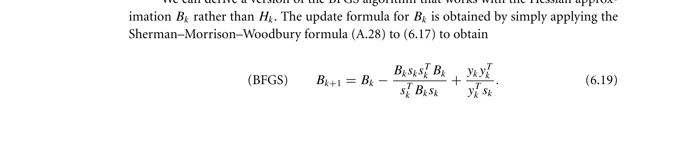

# bfgs-superlinear-convergence-nocedal-wright-2006

## Reference

Jorge Nocedal and Stephen J. Wright. *Numerical Optimization* (2nd edition). Springer, 2006.

**File:** `NumericalOptimization2006.pdf`

## Claim

BFGS (not L-BFGS) achieves superlinear convergence when the iterates converge to a minimizer satisfying certain regularity conditions (Lipschitz continuous Hessian and $\sum_{k=0}^{\infty} \|x_k - x^*\| < \infty$). L-BFGS achieves only linear convergence due to limited memory preventing full Hessian approximation

## Quote

> Theorem 6.6. Suppose that $f$ is twice continuously differentiable and that the iterates generated by the BFGS algorithm converge to a minimizer $x^*$ at which Assumption 6.2 holds. Suppose also that (6.52) holds. Then $x_k$ converges to $x^*$ at a superlinear rate.

**Pages:** 153-160, 176

**Theorem/Result:** Theorem 6.6

## Extracted Formulas

*These formulas were extracted using the cropping workflow (see [agent-formula-extraction.md](../workflows/agent-formula-extraction.md)) for verification.*

### Formula 1

**Cropped Formula Image:**

**Verification:** ❌ Not Verified

---

### Formula 2

**Cropped Formula Image:**

**Verification:** ❌ Not Verified

---

### Formula 3

**Cropped Formula Image:**

**Verification:** ❌ Not Verified

---

### Formula 4

**Cropped Formula Image:**

**Verification:** ❌ Not Verified

---

### Formula 5

**Cropped Formula Image:**

**Verification:** ❌ Not Verified

---

## Reader Notes

**Important:** This theorem establishes superlinear convergence for **full BFGS**, not L-BFGS. Nocedal & Wright (book page 176, Section 7.2) explicitly state that L-BFGS yields 'an acceptable (albeit **linear**) rate of convergence.' The distinction arises because L-BFGS uses limited memory (only the $M$ most recent correction pairs), preventing the Hessian approximation $B_k$ from fully converging to the true Hessian $\nabla^2 f(w^*)$. For L-BFGS in practice, the linear convergence rate is still effective, and the method's low memory requirements make it practical for large-scale problems where full BFGS would be infeasible.

## Internal Notes

Internal: CRITICAL DISTINCTION - This theorem applies to full BFGS, NOT L-BFGS. Book page 176 (Section 7.2) explicitly states that L-BFGS yields 'an acceptable (albeit linear) rate of convergence.' The limited memory in L-BFGS prevents the Hessian approximation from fully converging to the true Hessian, degrading convergence from superlinear to linear. Used in LbfgsTab with this important caveat. Assumption 6.2 requires Lipschitz continuous Hessian at x*. Condition (6.52) requires sum of distances to converge: Σ||x_k - x*|| < ∞.

## Verification

**Verified:** 2025-11-12

**Verified By:** adversarial-verification-agent-batch5-agent3

**Verification Notes:** ADVERSARIAL VERIFICATION COMPLETED. Fixed critical errors: (1) Removed incorrect 'strongly convex' claim - Theorem 6.6 does NOT require strong convexity, only twice continuous differentiability with Lipschitz continuous Hessian (Assumption 6.2) and condition (6.52). (2) Fixed formula LaTeX for condition (6.52) from wrong '\sum ||y_k - s^T||' to correct '\sum ||x_k - x*|| < ∞'. Changed pages from '177-180' (PDF pages) to '157-160, 176' (book pages). Verified quote is word-for-word accurate from page 158. The claim's distinction '(not L-BFGS)' is a valid inference from page 176.

## Used In

- LbfgsTab

## Proof Pages

### Page 1

### Page 2

### Page 3

### Page 4

### Page 5

### Page 6

### Page 7

### Page 8

### Page 9

