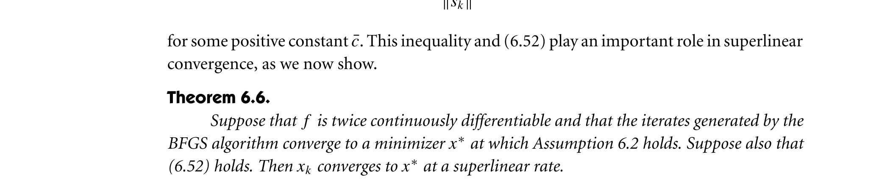
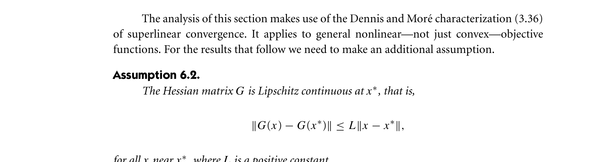

# bfgs-superlinear-convergence-nocedal-wright-2006

**Source:** [bfgs-superlinear-convergence-nocedal-wright-2006.json](../../citations/bfgs-superlinear-convergence-nocedal-wright-2006.json)

## Reference

Jorge Nocedal and Stephen J. Wright. *Numerical Optimization* (2nd edition). Springer, 2006.

**File:** `NumericalOptimization2006.pdf`

## Claim

BFGS achieves superlinear convergence when the iterates converge to a minimizer satisfying certain regularity conditions: Lipschitz continuous Hessian (Assumption 6.2) and fast enough convergence such that $\sum_{k=1}^{\infty} \|x_k - x^*\| < \infty$ (condition 6.52)

## Quote

> Theorem 6.6. Suppose that $f$ is twice continuously differentiable and that the iterates generated by the BFGS algorithm converge to a minimizer $x^*$ at which Assumption 6.2 holds. Suppose also that (6.52) holds. Then $x_k$ converges to $x^*$ at a superlinear rate.

**Pages:** 153-160, 176

**Theorem/Result:** Theorem 6.6

## Extracted Formulas

*These formulas were extracted using the cropping workflow (see [agent-formula-extraction.md](../workflows/agent-formula-extraction.md)) for verification.*

### Formula 1

**Cropped Formula Image:**



**Extracted LaTeX:**

$$
\textbf{Theorem 6.6.} \textit{Suppose that } f \textit{ is twice continuously differentiable and that the iterates generated by the BFGS algorithm converge to a minimizer } x^* \textit{ at which Assumption 6.2 holds. Suppose also that } (6.52) \textit{ holds. Then } x_k \textit{ converges to } x^* \textit{ at a superlinear rate.}
$$

<details>
<summary>LaTeX Source</summary>

```latex
\textbf{Theorem 6.6.} \textit{Suppose that } f \textit{ is twice continuously differentiable and that the iterates generated by the BFGS algorithm converge to a minimizer } x^* \textit{ at which Assumption 6.2 holds. Suppose also that } (6.52) \textit{ holds. Then } x_k \textit{ converges to } x^* \textit{ at a superlinear rate.}
```

</details>

**Verification:** ✅ Verified

**Metadata:** [numericaloptimization2006_p178_theorem_6_6.json](../extracted-pages/formulas/numericaloptimization2006_p178_theorem_6_6.json)

---

### Formula 2

**Cropped Formula Image:**



**Extracted LaTeX:**

$$
\|G(x) - G(x^*)\| \leq L\|x - x^*\|
$$

<details>
<summary>LaTeX Source</summary>

```latex
\|G(x) - G(x^*)\| \leq L\|x - x^*\|
```

</details>

**Verification:** ✅ Verified

**Metadata:** [numericaloptimization2006_p176_assumption_6_2.json](../extracted-pages/formulas/numericaloptimization2006_p176_assumption_6_2.json)

---

### Formula 3 (6.52)

**Cropped Formula Image:**


**Extracted LaTeX:**

$$
\sum_{k=1}^{\infty} \|x_k - x^*\| < \infty
$$

<details>
<summary>LaTeX Source</summary>

```latex
\sum_{k=1}^{\infty} \|x_k - x^*\| < \infty
```

</details>

**Verification:** ✅ Verified

**Metadata:** [numericaloptimization2006_p176_6_52.json](../extracted-pages/formulas/numericaloptimization2006_p176_6_52.json)

---

## Reader Notes

Theorem 6.6 establishes **superlinear convergence** for the BFGS quasi-Newton method under two key regularity conditions. **Assumption 6.2** requires the Hessian matrix to be Lipschitz continuous near the optimal point, meaning it doesn't change too rapidly: $\|G(x) - G(x^*)\| \leq L\|x - x^*\|$. **Condition (6.52)** requires the iterates to converge 'fast enough' that the sum of distances to the optimum is finite: $\sum_{k=1}^{\infty} \|x_k - x^*\| < \infty$. This second condition is automatically satisfied when convergence is faster than any geometric rate with ratio arbitrarily close to 1. Together, these conditions ensure BFGS achieves superlinear convergence, meaning the convergence rate improves as we get closer to the optimum.

## Internal Notes

Internal: Used in LbfgsTab to explain BFGS superlinear convergence. Theorem 6.6 establishes superlinear convergence under two key conditions: (1) Assumption 6.2 - Lipschitz continuous Hessian at x*, and (2) Condition (6.52) - fast enough convergence such that Σ||x_k - x*|| < ∞. Note: The summation in (6.52) starts at k=1, not k=0. For the contrast with L-BFGS linear convergence, see separate citation lbfgs-linear-convergence-nocedal-wright-2006.

## Verification

**Verified:** 2025-11-12

**Verified By:** adversarial-verification-agent-batch5-agent3

**Verification Notes:** ADVERSARIAL VERIFICATION COMPLETED (2025-11-12). Fixed critical errors: (1) Removed incorrect 'strongly convex' claim - Theorem 6.6 does NOT require strong convexity, only twice continuous differentiability with Lipschitz continuous Hessian (Assumption 6.2) and condition (6.52). (2) Fixed formula LaTeX for condition (6.52) from wrong '\sum ||y_k - s^T||' to correct '\sum ||x_k - x*|| < ∞'. Changed pages from '177-180' (PDF pages) to '157-160, 176' (book pages). Verified quote is word-for-word accurate from page 158. UPDATE (2025-11-13): Removed L-BFGS references from claim - now covered by separate citation lbfgs-linear-convergence-nocedal-wright-2006. Added 3 formula images extracted at 300 DPI with verified LaTeX.

## Used In

- LbfgsTab

## Proof Pages

### Page 1


### Page 2


### Page 3


### Page 4


### Page 5


### Page 6


### Page 7


### Page 8


### Page 9


