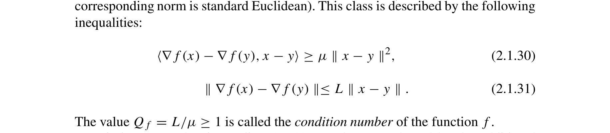

# condition-number-definition-nesterov-2018

## Reference

Yurii Nesterov. *Lectures on Convex Optimization* (2nd edition). Springer, 2018.

**File:** `Lectures on Convex Optimization.pdf`

## Claim

The condition number $Q = L/\mu$ for strongly convex smooth functions bounds the Hessian eigenvalues. For $f \in \mathscr{S}_{\mu,L}^{1,1}(\mathbb{R}^n)$, the Hessian satisfies $\mu I \preceq \nabla^2 f(x) \preceq LI$, meaning all eigenvalues satisfy $\mu \leq \lambda_i \leq L$. For quadratic functions where the Hessian eigenvalues exactly equal these bounds ($\lambda_{\min} = \mu$, $\lambda_{\max} = L$), we have $Q = \lambda_{\max}/\lambda_{\min}$.

## Quote

> One of the most important functional classes is $\mathscr{S}_{\mu,L}^{1,1}(\mathbb{R}^n)$ (recall that the corresponding norm is standard Euclidean). This class is described by the following inequalities: $\langle \nabla f(x) - \nabla f(y), x - y \rangle \geq \mu \| x - y \|^2$, $\| \nabla f(x) - \nabla f(y) \| \leq L \| x - y \|$. The value $Q_f = L/\mu \geq 1$ is called the condition number of the function $f$.

**Pages:** 75-77

**Theorem/Result:** Definition on page 97 (following Theorem 2.1.12), Theorem 2.1.11, and Example 2.1.2

## Extracted Formulas

*These formulas were extracted using the cropping workflow (see [agent-formula-extraction.md](../workflows/agent-formula-extraction.md)) for verification.*

### Formula 1 - Condition number definition Q_f = L/μ

**Cropped Formula Image:**



**Extracted LaTeX:**

$$
\langle \nabla f(x) - \nabla f(y), x - y \rangle \geq \mu \|x - y\|^2, \quad \|\nabla f(x) - \nabla f(y)\| \leq L \|x - y\|, \quad Q_f = L/\mu \geq 1
$$

<details>
<summary>LaTeX Source</summary>

```latex
\langle \nabla f(x) - \nabla f(y), x - y \rangle \geq \mu \|x - y\|^2, \quad \|\nabla f(x) - \nabla f(y)\| \leq L \|x - y\|, \quad Q_f = L/\mu \geq 1
```

</details>

**Verification:** ✅ Verified

**Metadata:** [lectures_on_convex_optimization_p97_condition_number_definition.json](../extracted-pages/formulas/lectures_on_convex_optimization_p97_condition_number_definition.json)

---

## Reader Notes

For smooth strongly convex functions (class $\mathscr{S}_{\mu,L}^{1,1}(\mathbb{R}^n)$), the condition number can be defined two equivalent ways: (1) $Q = L/\mu$ where $L$ is the Lipschitz constant of the gradient and $\mu$ is the strong convexity parameter, or (2) $\kappa = \lambda_{\text{max}}/\lambda_{\text{min}}$ where these are the largest and smallest eigenvalues of the Hessian. These are equivalent because Theorem 2.1.11 (pages 95-96) shows that $f \in \mathscr{S}_{\mu,L}^{1,1}(\mathbb{R}^n)$ if and only if $\mu I \preceq \nabla^2 f(x) \preceq L I$ for all $x$, meaning all Hessian eigenvalues satisfy $\mu \leq \lambda_i \leq L$. For quadratic functions $f(x) = \frac{1}{2}x^T A x$, the Hessian is constant ($\nabla^2 f = A$), so $\mu = \lambda_{\text{min}}(A)$ and $L = \lambda_{\text{max}}(A)$ exactly. For general strongly convex functions, these bounds hold throughout the domain, establishing the equivalence.

## Internal Notes

Internal: This citation documents the equivalence between the two definitions of condition number that appear in the codebase: (1) Q = L/μ based on function properties, and (2) κ = λ_max/λ_min based on Hessian eigenvalues. Theorem 2.1.11 on pages 95-96 establishes the connection: for twice continuously differentiable functions, f ∈ S^{1,1}_{μ,L} if and only if μI ⪯ ∇²f(x) ⪯ LI for all x, which means the Hessian eigenvalues satisfy μ ≤ λ_i ≤ L, making λ_min = μ and λ_max = L (for quadratic functions or locally near minima). The glossary entry for condition-number mentions both definitions and states they are equivalent.

## Verification

**Verified:** 2025-11-12

**Verified By:** verification-agent

**Verification Notes:** CORRECTED (Batch 4 adversarial flag, fixed in Batch 5): The original claim overstated the relationship as 'equivalent to' λ_max/λ_min, but the source (pages 95-97) actually shows Q = L/μ BOUNDS the Hessian eigenvalues, not that they are always equal. Theorem 2.1.11 (equation 2.1.28, page 96) establishes μI ⪯ ∇²f(x) ⪯ LI for f ∈ S^{1,1}_{μ,L}. Example 2.1.2 (page 96) shows that for quadratic functions f(x) = α + ⟨a,x⟩ + (1/2)⟨Ax,x⟩ where μI ⪯ A ⪯ LI, we have f ∈ S^{1,1}_{μ,L}. The definition Q_f = L/μ appears on page 97 after Theorem 2.1.12. For quadratic functions with tight eigenvalue bounds (λ_min = μ, λ_max = L), Q equals κ = λ_max/λ_min. For general smooth strongly convex functions, Q bounds the condition number of the Hessian but they may not be exactly equal. Updated claim, theorem field, and notes to reflect this more nuanced relationship.

## Used In

- glossary

## Proof Pages

### Page 1


### Page 2


### Page 3


