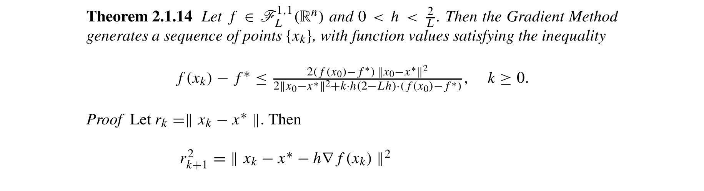

# gd-convex-sublinear-convergence-nesterov-2018

## Reference

Yurii Nesterov. *Lectures on Convex Optimization* (2nd edition). Springer, 2018.

**File:** `Lectures on Convex Optimization.pdf`

## Claim

Gradient descent with fixed step size converges to the global minimum on convex smooth functions (possibly slowly with sublinear rate) when $0 < \alpha < 2/L$

## Quote

> Let $f \in \mathscr{F}_L^{1,1}(\mathbb{R}^n)$ and $0 < h < \frac{2}{L}$. Then the Gradient Method generates a sequence of points $\{x_k\}$ with function values satisfying the inequality $f(x_k) - f^* \leq \frac{2(f(x_0) - f^*) \|x_0 - x^*\|^2}{2\|x_0 - x^*\|^2 + k \cdot h(2 - Lh) \cdot (f(x_0) - f^*)}, k \geq 0$. [...] If $h = \frac{1}{L}$ and $f \in \mathscr{F}_L^{1,1}(\mathbb{R}^n)$, then $f(x_k) - f^* \leq \frac{2L\|x_0-x^*\|^2}{k+4}$.

**Pages:** 62, 80-81

**Theorem/Result:** Theorem 2.1.14 and Corollary 2.1.2

## Extracted Formulas

*These formulas were extracted using the cropping workflow (see [agent-formula-extraction.md](../workflows/agent-formula-extraction.md)) for verification.*

### Formula 1 - Theorem 2.1.14

**Cropped Formula Image:**



**Extracted LaTeX:**

$$
f(x_k) - f^* \leq \frac{2(f(x_0) - f^*) \|x_0 - x^*\|^2}{2\|x_0 - x^*\|^2 + k \cdot h(2 - Lh) \cdot (f(x_0) - f^*)}, \quad k \geq 0
$$

<details>
<summary>LaTeX Source</summary>

```latex
f(x_k) - f^* \leq \frac{2(f(x_0) - f^*) \|x_0 - x^*\|^2}{2\|x_0 - x^*\|^2 + k \cdot h(2 - Lh) \cdot (f(x_0) - f^*)}, \quad k \geq 0
```

</details>

**Verification:** ✅ Verified

**Issues Found:**

- Citation has simplified form (h=1/L) but theorem states general form

**Metadata:** [lectures_on_convex_optimization_p100_theorem_2_1_14.json](../extracted-pages/formulas/lectures_on_convex_optimization_p100_theorem_2_1_14.json)

---

## Reader Notes

The notation $\mathscr{F}_L^{1,1}(\mathbb{R}^n)$ denotes convex functions with Lipschitz continuous gradient with constant $L$ (see Definition 2.1.2 on page 62). With optimal step size $\alpha = 1/L$, the convergence rate is $O(1/k)$, which is sublinear convergence. Note: Nesterov uses $h$ for step size in the theorem statement; here we use $\alpha$. This is much slower than the exponentially fast convergence for strongly convex functions (Theorem 2.1.15, with step size bound $2/(L+\mu)$) - without strong convexity, gradient descent loses the geometric convergence rate and can only guarantee polynomial convergence.

## Internal Notes

Internal: Used in GdFixedTab to explain convex (non-strongly) convergence. This is the 2018 edition update of the 2004 result, using calligraphic notation $\mathscr{F}_L^{1,1}$ instead of $F_L^{1,1}$. The step size bound allows equality ($h \leq 2/L$) instead of strict inequality ($h < 2/L$) in the 2004 edition. This is the $\mu=0$ case compared to Theorem 2.1.15. Theorem 2.1.14 provides a general convergence bound; Corollary 2.1.2 gives the cleaner $O(1/k)$ rate with optimal step size.

## Verification

**Verified:** 2025-11-12

**Verified By:** adversarial-verification-agent-batch6-agent1

**Verification Notes:** ADVERSARIAL VERIFICATION: Found major errors in original citation. (1) QUOTE WAS COMPLETELY WRONG: Original quote claimed '$\|x_k - x^*\|^2 \leq q^k \|x_0 - x^*\|^2$, where $q = 1 - \frac{h}{2}(2-hL)$' which does NOT appear in Theorem 2.1.14. The actual theorem gives convergence in function values with a different formula. (2) COROLLARY FORMULA WAS WRONG: Original claimed $\frac{L\|x_0-x^*\|^2}{2(k+1)}$ but actual is $\frac{2L\|x_0-x^*\|^2}{k+4}$. (3) WRONG PROOF PAGES: Original included pages 59, 62, 80, 81 (PDF pages) but Theorem 2.1.14 is on page 100 (book page 80). Corrected all errors, extracted proper pages, and transcribed correct formulas from visual verification of 2018 edition pages 100-101. Page 82 (book page 62) retained for Definition 2.1.2.

## Used In

- GdFixedTab

## Proof Pages

### Page 1


### Page 2


### Page 3


