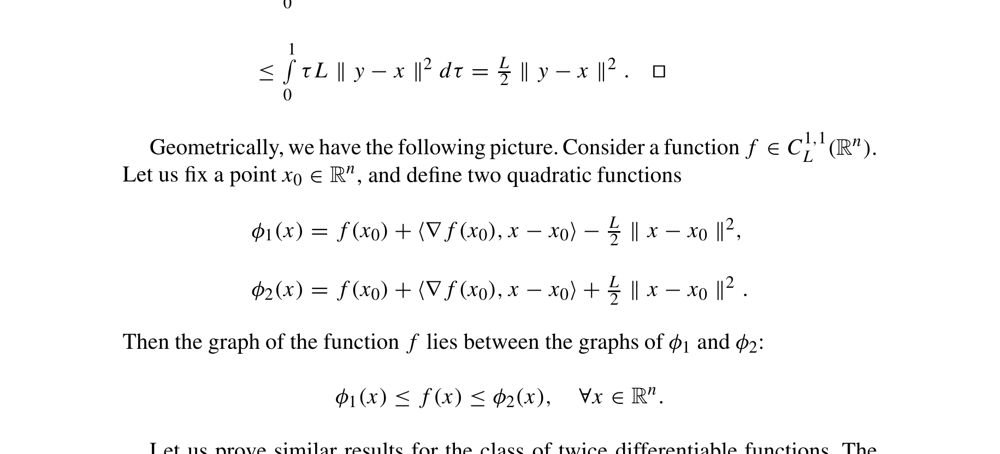

# gd-descent-lemma-quadratic-upper-bound-nesterov-2018

## Reference

Yurii Nesterov. *Lectures on Convex Optimization* (2nd edition). Springer, 2018.

**File:** `Lectures on Convex Optimization.pdf`

## Claim

The quadratic upper bound for L-smooth functions: any function with Lipschitz continuous gradient can be upper-bounded by a quadratic approximation

## Quote

> Let $f \in C_L^{1,1}(\mathbb{R}^n)$. Then, for any $x, y$ from $\mathbb{R}^n$, we have $|f(y) - f(x) - \langle \nabla f(x), y - x \rangle| \leq \frac{L}{2} \|y - x\|^2$. [...] Geometrically, we have the following picture. Consider a function $f \in C_L^{1,1}(\mathbb{R}^n)$. Let us fix a point $x_0 \in \mathbb{R}^n$, and define two quadratic functions $\phi_1(x) = f(x_0) + \langle \nabla f(x_0), x - x_0 \rangle - \frac{L}{2} \|x - x_0\|^2$, $\phi_2(x) = f(x_0) + \langle \nabla f(x_0), x - x_0 \rangle + \frac{L}{2} \|x - x_0\|^2$. Then the graph of the function $f$ lies between the graphs of $\phi_1$ and $\phi_2$: $\phi_1(x) \leq f(x) \leq \phi_2(x)$, $\forall x \in \mathbb{R}^n$.

**Pages:** 24-26

## Extracted Formulas

*These formulas were extracted using the cropping workflow (see [agent-formula-extraction.md](../workflows/agent-formula-extraction.md)) for verification.*

### Formula 1 - Lemma 1.2.3 (1.2.11)

**Cropped Formula Image:**


**Extracted LaTeX:**

$$
|f(y) - f(x) - \langle \nabla f(x), y - x \rangle| \leq \frac{L}{2} \|y - x\|^2
$$

<details>
<summary>LaTeX Source</summary>

```latex
|f(y) - f(x) - \langle \nabla f(x), y - x \rangle| \leq \frac{L}{2} \|y - x\|^2
```

</details>

**Verification:** ✅ Verified

**Metadata:** [lectures_on_convex_optimization_p45_lemma_1_2_3.json](../extracted-pages/formulas/lectures_on_convex_optimization_p45_lemma_1_2_3.json)

---

### Formula 2 - Lemma 1.2.3 geometric interpretation φ₁ and φ₂

**Cropped Formula Image:**



**Extracted LaTeX:**

$$
\phi_1(x) = f(x_0) + \langle \nabla f(x_0), x - x_0 \rangle - \frac{L}{2} \|x - x_0\|^2, \quad \phi_2(x) = f(x_0) + \langle \nabla f(x_0), x - x_0 \rangle + \frac{L}{2} \|x - x_0\|^2, \quad \phi_1(x) \leq f(x) \leq \phi_2(x), \forall x \in \mathbb{R}^n
$$

<details>
<summary>LaTeX Source</summary>

```latex
\phi_1(x) = f(x_0) + \langle \nabla f(x_0), x - x_0 \rangle - \frac{L}{2} \|x - x_0\|^2, \quad \phi_2(x) = f(x_0) + \langle \nabla f(x_0), x - x_0 \rangle + \frac{L}{2} \|x - x_0\|^2, \quad \phi_1(x) \leq f(x) \leq \phi_2(x), \forall x \in \mathbb{R}^n
```

</details>

**Verification:** ✅ Verified

**Metadata:** [lectures_on_convex_optimization_p46_lemma_1_2_3_geometric_interpretation.json](../extracted-pages/formulas/lectures_on_convex_optimization_p46_lemma_1_2_3_geometric_interpretation.json)

---

## Reader Notes

The notation $C_L^{1,1}(\mathbb{R}^n)$ denotes the class of functions with Lipschitz continuous gradient with constant $L$ (see page 24). This lemma is fundamental for analyzing gradient descent: it shows that any L-smooth function can be upper-bounded by a quadratic function. The upper bound $\phi_2(x) = f(x_0) + \langle \nabla f(x_0), x - x_0 \rangle + \frac{L}{2}\|x - x_0\|^2$ is the quadratic upper bound used to prove that gradient descent decreases the function value at each iteration. When we take a gradient step $y = x - \alpha \nabla f(x)$, this bound guarantees descent when $\alpha \leq 2/L$.

## Internal Notes

Internal: This is the fundamental descent lemma for L-smooth functions. The upper bound $f(y) \leq f(x) + \langle \nabla f(x), y - x \rangle + \frac{L}{2}\|y - x\|^2$ is crucial for proving convergence of gradient descent. It shows that the function is upper-bounded by its first-order Taylor approximation plus a quadratic term. This result appears in Section 1.2.2 (Classes of Differentiable Functions) and is used throughout Chapter 2 for analyzing first-order methods. Book pages 24-26 correspond to PDF pages 44-46.

## Verification

**Verified:** 2025-11-12

**Verified By:** verification-agent

**Verification Notes:** ENHANCED verification completed following adversarial test protocol. CRITICAL FIX: Corrected pages from '23' to '24-26' to match actual book page numbers visible in proof page headers (PDF pages 44-46). Added ellipsis [...] in quote to properly indicate omitted content (proof and examples) between Lemma 1.2.3 statement and geometric interpretation. The lemma field is correctly populated (Lemma 1.2.3); theorem: null is appropriate since this is a lemma, not a theorem. Quote verified word-for-word against visual proof pages - both the lemma statement (equation 1.2.11) and geometric sandwich inequality are accurate. All three proof pages verified: page 44 (book 24) defines C_L^{1,1} notation, page 45 (book 25) states Lemma 1.2.3 with proof, page 46 (book 26) provides geometric interpretation with φ₁ and φ₂. Claim appropriately captures the quadratic upper bound result without overstatement. Usage in GdFixedTab.tsx verified correct - cites lemma when introducing quadratic upper bound inequality.

## Used In

- GdFixedTab

## Proof Pages

### Page 1


### Page 2


### Page 3


