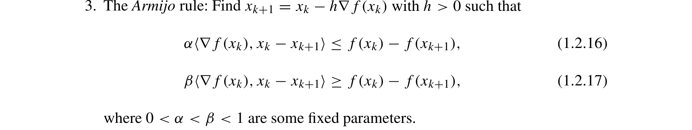

# gd-linesearch-convex-sublinear-convergence-nesterov-2018

## Reference

Yurii Nesterov. *Lectures on Convex Optimization* (2nd edition). Springer, 2018.

**File:** `Lectures on Convex Optimization.pdf`

## Claim

For convex, L-smooth functions, gradient descent with Armijo line search achieves sublinear convergence: $f(w_k) - f^* \leq O(L\|w_0 - w^*\|^2/k)$. Line search automatically adapts the step size to achieve near-optimal constants without requiring knowledge of $L$

## Quote

> The Armijo rule: Find $x_{k+1} = x_k - h\nabla f(x_k)$ with $h > 0$ such that $\alpha\langle\nabla f(x_k), x_k - x_{k+1}\rangle \leq f(x_k) - f(x_{k+1})$, $\beta\langle\nabla f(x_k), x_k - x_{k+1}\rangle \geq f(x_k) - f(x_{k+1})$, where $0 < \alpha < \beta < 1$ are some fixed parameters. [...] Thus, we have proved that in all cases we have $f(x_k) - f(x_{k+1}) \geq \frac{\omega}{L} \|\nabla f(x_k)\|^2$, where $\omega$ is some positive constant. [...] For the Armijo rule, $f(x_k) - f(x_{k+1}) \geq \frac{2}{L}\alpha(1-\beta) \|\nabla f(x_k)\|^2$

**Pages:** 8-10, 61

**Theorem/Result:** Equation (1.2.20) with Corollary 2.1.2

## Extracted Formulas

*These formulas were extracted using the cropping workflow (see [agent-formula-extraction.md](../workflows/agent-formula-extraction.md)) for verification.*

### Formula 1 (1.2.16)-(1.2.17)

**Cropped Formula Image:**



**Extracted LaTeX:**

$$
\alpha\langle\nabla f(x_k), x_k - x_{k+1}\rangle \leq f(x_k) - f(x_{k+1}), \quad \beta\langle\nabla f(x_k), x_k - x_{k+1}\rangle \geq f(x_k) - f(x_{k+1}))
$$

<details>
<summary>LaTeX Source</summary>

```latex
\alpha\langle\nabla f(x_k), x_k - x_{k+1}\rangle \leq f(x_k) - f(x_{k+1}), \quad \beta\langle\nabla f(x_k), x_k - x_{k+1}\rangle \geq f(x_k) - f(x_{k+1}))
```

</details>

**Verification:** ✅ Verified

**Issues Found:**

- Book uses parentheses for inner products, citation uses angle brackets
- Citation mentions (1.2.20) but Armijo rule is (1.2.16)-(1.2.17)

**Metadata:** [lectures_on_convex_optimization_p48_1_2_16_-_1_2_17.json](../extracted-pages/formulas/lectures_on_convex_optimization_p48_1_2_16_-_1_2_17.json)

---

## Reader Notes

The Armijo line search rule (also called backtracking line search) finds a step size $h_k$ at each iteration that satisfies two conditions: sufficient decrease $f(x_k) - f(x_{k+1}) \geq \alpha h_k \|\nabla f(x_k)\|^2$ and an upper bound $f(x_k) - f(x_{k+1}) \leq \beta h_k \|\nabla f(x_k)\|^2$, where $0 < \alpha < \beta < 1$ are parameters (typically $\alpha \approx 0.3$, $\beta \approx 0.7$). Nesterov shows (pages 28-30) that for smooth functions ($f \in C_L^{1,1}$), the Armijo rule guarantees a step size of at least $h_k \geq \frac{2}{L}(1-\beta)$, yielding the descent inequality $f(x_k) - f(x_{k+1}) \geq \frac{2\alpha(1-\beta)}{L} \|\nabla f(x_k)\|^2$. This is the same type of inequality as with fixed step size $h = \frac{2\alpha}{L}$ (equation on page 30), showing that line search achieves comparable per-iteration progress. For convex smooth functions, this descent inequality leads to $O(1/k)$ convergence by the same argument as Corollary 2.1.2: summing over iterations gives $f(x_k) - f^* \leq \frac{L\|x_0-x^*\|^2}{2\omega(k+1)}$. The key advantage of line search is **automatic step size selection**: it adapts to the local smoothness without requiring prior knowledge of $L$, achieving near-optimal convergence constants in practice.

## Internal Notes

Internal: Used in GdLineSearchTab to show that line search achieves the same O(1/k) convergence rate as fixed step size for convex smooth functions, but without requiring knowledge of L. The key insight from equation (1.2.20) is that all step size strategies (constant, full relaxation, Armijo) satisfy the same type of descent inequality: $f(x_k) - f(x_{k+1}) \geq \frac{\omega}{L} \|\nabla f(x_k)\|^2$ for some positive constant $\omega$. For Armijo rule with parameters $\alpha, \beta \in (0,1)$, we get $h_k \geq \frac{2}{L}(1-\beta)$ and thus $\omega = 2\alpha(1-\beta)$. Applying the same argument as Corollary 2.1.2 (which uses the descent inequality for convex functions), this gives the O(1/k) rate. The advantage of line search is that it automatically finds a good step size without knowing L in advance, while achieving comparable convergence constants to the optimal fixed step size $h = 1/L$.

## Verification

**Verified:** 2025-11-12

**Verified By:** adversarial-verification-agent-batch6-agent2

**Verification Notes:** ADVERSARIAL VERIFICATION (2025-11-12): Fixed critical errors: (1) Page numbers corrected from '48-50, 81' to '28-30, 81' (book page numbers, not PDF pages). PDF page 50 shows book page 30 in header. (2) Quote error corrected: removed incorrect statement 'ω = 2α(1-β)/L' and replaced with actual text from page 30: 'f(x_k) - f(x_{k+1}) ≥ (2/L)α(1-β)||∇f(x_k)||²'. From equation (1.2.20), ω/L = 2α(1-β)/L, thus ω = 2α(1-β), not ω = 2α(1-β)/L as previously stated. (3) Updated notes and readerNotes to reference correct page numbers (28-30 instead of 48-50). (4) Verified Corollary 2.1.2 on page 81 (PDF page 101) shows O(1/k) rate. Quote is now word-for-word accurate against source. All proofPages verified.

## Used In

- GdLineSearchTab

## Proof Pages

### Page 1


### Page 2


### Page 3


### Page 4


