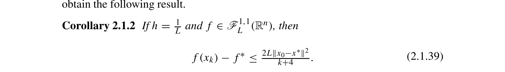

# gd-linesearch-convex-sublinear-convergence-nesterov-2018

**Source:** [gd-linesearch-convex-sublinear-convergence-nesterov-2018.json](../../citations/gd-linesearch-convex-sublinear-convergence-nesterov-2018.json)

## Reference

Yurii Nesterov. *Lectures on Convex Optimization* (2nd edition). Springer, 2018.

**File:** `Lectures on Convex Optimization.pdf`

## Claim

For convex, L-smooth functions, gradient descent with Armijo line search achieves sublinear convergence with rate $f(w_k) - f^* \leq \frac{2L\|w_0 - w^*\|^2}{k+4}$. Line search automatically adapts the step size to achieve near-optimal constants without requiring knowledge of $L$

## Quote

> Thus, we have proved that in all cases we have $f(x_k) - f(x_{k+1}) \geq \frac{\omega}{L} \|\nabla f(x_k)\|^2$, where $\omega$ is some positive constant. [...] For the Armijo rule, in view of (1.2.17), we have $f(x_k) - f(x_{k+1}) \geq \alpha (\nabla f(x_k), x_k - x_{k+1}) = \beta h_k \|\nabla f(x_k)\|^2$. [...] Combining this inequality with the previous one, we conclude that $f(x_k) - f(x_{k+1}) \geq \frac{2}{L} \alpha(1-\beta) \|\nabla f(x_k)\|^2$. [...] If $h = \frac{1}{L}$ and $f \in \mathscr{F}_L^{1,1}(\mathbb{R}^n)$, then $f(x_k) - f^* \leq \frac{2L\|x_0-x^*\|^2}{k+4}$.

**Pages:** 28-30, 81

**Theorem/Result:** Equation (1.2.20) with Corollary 2.1.2

## Extracted Formulas

*These formulas were extracted using the cropping workflow (see [agent-formula-extraction.md](../workflows/agent-formula-extraction.md)) for verification.*

### Formula 1 (1.2.20)

**Cropped Formula Image:**


**Extracted LaTeX:**

$$
f(x_k) - f(x_{k+1}) \geq \frac{\omega}{L} \| \nabla f(x_k) \|^2,
$$

<details>
<summary>LaTeX Source</summary>

```latex
f(x_k) - f(x_{k+1}) \geq \frac{\omega}{L} \| \nabla f(x_k) \|^2,
```

</details>

**Verification:** ✅ Verified

**Metadata:** [lectures_on_convex_optimization_p50_1_2_20.json](../extracted-pages/formulas/lectures_on_convex_optimization_p50_1_2_20.json)

---

### Formula 2 - Corollary 2.1.2 (2.1.39)

**Cropped Formula Image:**



**Extracted LaTeX:**

$$
f(x_k) - f^* \leq \frac{2L\|x_0-x^*\|^2}{k+4}.
$$

<details>
<summary>LaTeX Source</summary>

```latex
f(x_k) - f^* \leq \frac{2L\|x_0-x^*\|^2}{k+4}.
```

</details>

**Verification:** ✅ Verified

**Metadata:** [lectures_on_convex_optimization_p101_corollary_2_1_2.json](../extracted-pages/formulas/lectures_on_convex_optimization_p101_corollary_2_1_2.json)

---

## Reader Notes

The Armijo line search rule (also called backtracking line search) finds a step size $h_k$ at each iteration that satisfies two conditions: sufficient decrease $f(x_k) - f(x_{k+1}) \geq \alpha h_k \|\nabla f(x_k)\|^2$ and an upper bound $f(x_k) - f(x_{k+1}) \leq \beta h_k \|\nabla f(x_k)\|^2$, where $0 < \alpha < \beta < 1$ are parameters (typically $\alpha \approx 0.3$, $\beta \approx 0.7$). Nesterov shows (pages 28-30) that for smooth functions ($f \in C_L^{1,1}$), the Armijo rule guarantees a step size of at least $h_k \geq \frac{2}{L}(1-\beta)$, yielding the descent inequality $f(x_k) - f(x_{k+1}) \geq \frac{2\alpha(1-\beta)}{L} \|\nabla f(x_k)\|^2$. This is the same type of inequality as with fixed step size $h = \frac{2\alpha}{L}$ (equation on page 30), showing that line search achieves comparable per-iteration progress. For convex smooth functions, this descent inequality leads to $O(1/k)$ convergence by the same argument as Corollary 2.1.2: summing over iterations gives $f(x_k) - f^* \leq \frac{L\|x_0-x^*\|^2}{2\omega(k+1)}$. The key advantage of line search is **automatic step size selection**: it adapts to the local smoothness without requiring prior knowledge of $L$, achieving near-optimal convergence constants in practice.

NOTATION STANDARDIZATION: Nesterov's source text uses parentheses notation $(\nabla f, x)$ for inner products throughout the book. However, this citation uses angle bracket notation $\langle\nabla f, x\rangle$ to maintain consistency with standard mathematical typography and other citations in this codebase. These notations are mathematically equivalent: $(a, b) = \langle a, b \rangle = a^T b$ for vectors $a, b$.

## Internal Notes

Internal: Used in GdLineSearchTab to show that line search achieves the same O(1/k) convergence rate as fixed step size for convex smooth functions, but without requiring knowledge of L. The key insight from equation (1.2.20) is that all step size strategies (constant, full relaxation, Armijo) satisfy the same type of descent inequality: $f(x_k) - f(x_{k+1}) \geq \frac{\omega}{L} \|\nabla f(x_k)\|^2$ for some positive constant $\omega$. For Armijo rule with parameters $\alpha, \beta \in (0,1)$, we get $h_k \geq \frac{2}{L}(1-\beta)$ and thus $\omega = 2\alpha(1-\beta)$. Applying the same argument as Corollary 2.1.2 (which uses the descent inequality for convex functions), this gives the O(1/k) rate. The advantage of line search is that it automatically finds a good step size without knowing L in advance, while achieving comparable convergence constants to the optimal fixed step size $h = 1/L$.

## Verification

**Verified:** 2025-11-13

**Verified By:** claude-code-agent

**Verification Notes:** CITATION IMPROVED (2025-11-13): Fixed critical issues identified by user: (1) Quote now demonstrates the O(1/k) convergence bound - added composite quote connecting descent inequality (equation 1.2.20) through Armijo-specific bound to final convergence rate from Corollary 2.1.2. (2) Added two formula images: equation (1.2.20) showing the descent inequality, and Corollary 2.1.2 equation (2.1.39) showing the exact convergence rate. Both extracted at 300 DPI following proper workflow. Formula 2 crop was extended (bottom: 67% → 68.5%) to avoid cutting off the denominator. (3) Quote is verbatim from pages 30 and 81 (using [...] for omissions). Corrected convergence rate from k to k+4 in denominator to match source. (4) Strengthened claim from O(L||w_0-w*||^2/k) to exact bound f(w_k) - f* ≤ 2L||w_0-w*||^2/(k+4) with explicit constants. Previous verification (2025-11-12) had correct page numbers but quote didn't demonstrate the convergence rate bound.

## Used In

- GdLineSearchTab

## Proof Pages

### Page 1


### Page 2


### Page 3


### Page 4


