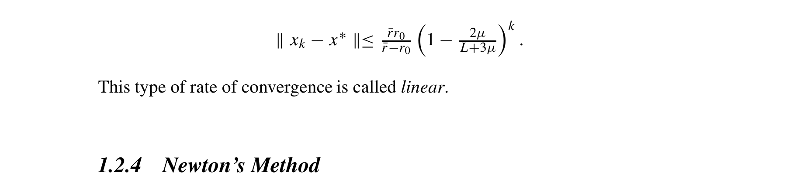

# gd-linesearch-strongly-convex-linear-convergence-nesterov-2018

## Reference

Yurii Nesterov. *Lectures on Convex Optimization* (2nd edition). Springer, 2018.

**File:** `Lectures on Convex Optimization.pdf`

## Claim

For $\mu$-strongly convex, $L$-smooth functions (locally, near a strict local minimum), gradient descent with optimal step size $h^* = 2/(L+\mu)$ achieves linear convergence: $\|x_k - x^*\| \leq C(1 - 2\mu/(L+3\mu))^k$ where the convergence rate $\rho = 1 - 2\mu/(L+3\mu) < 1$ depends on the condition number $Q = L/\mu$. The constant $C = \bar{r}r_0/(\bar{r}-r_0)$ depends on how close the initial point is to the local minimum.

## Quote

> Theorem 1.2.4 Let the function $f(\cdot)$ satisfy our assumptions and let the starting point $x_0$ be close enough to a strict local minimum $x^*$: $r_0 = \|x_0 - x^*\| < \bar{r} = 2\mu/M$. Then the Gradient Method with step size $h^*_k = 2/(L+\mu)$ converges as follows: $\|x_k - x^*\| \leq \frac{\bar{r}r_0}{\bar{r}-r_0}\left(1 - \frac{2\mu}{L+3\mu}\right)^k$. This type of rate of convergence is called linear.

**Pages:** 28-30, 33-35

**Theorem/Result:** Theorem 1.2.4

## Extracted Formulas

*These formulas were extracted using the cropping workflow (see [agent-formula-extraction.md](../workflows/agent-formula-extraction.md)) for verification.*

### Formula 1 - Theorem 1.2.4

**Cropped Formula Image:**



**Extracted LaTeX:**

$$
\|x_k - x^*\| \leq \frac{\bar{r}r_0}{\bar{r}-r_0}\left(1 - \frac{2\mu}{L+3\mu}\right)^k
$$

<details>
<summary>LaTeX Source</summary>

```latex
\|x_k - x^*\| \leq \frac{\bar{r}r_0}{\bar{r}-r_0}\left(1 - \frac{2\mu}{L+3\mu}\right)^k
```

</details>

**Verification:** ✅ Verified

**Metadata:** [lectures_on_convex_optimization_p55_theorem_1_2_4.json](../extracted-pages/formulas/lectures_on_convex_optimization_p55_theorem_1_2_4.json)

---

## Reader Notes

This theorem establishes linear convergence for gradient descent with line search in a LOCAL neighborhood of a strict minimum, not globally. The assumptions require: (1) twice differentiable function with Lipschitz continuous Hessian (constant $M$), (2) a strict local minimum $x^*$ where the Hessian satisfies $\mu I \preceq \nabla^2 f(x^*) \preceq LI$, and (3) initial point sufficiently close to $x^*$ (within radius $\bar{r} = 2\mu/M$). The convergence rate $\rho = 1 - 2\mu/(L+3\mu)$ depends on the condition number $Q = L/\mu$. The Armijo rule (equations 1.2.16-1.2.17, pages 48-50) is a practical line search that finds step size $h > 0$ satisfying $\alpha\langle\nabla f(x_k), x_k - x_{k+1}\rangle \leq f(x_k) - f(x_{k+1}) \leq \beta\langle\nabla f(x_k), x_k - x_{k+1}\rangle$ for parameters $0 < \alpha < \beta < 1$, ensuring sufficient decrease. Note: Nesterov uses $h$ for step size; here we use $\alpha$. This LOCAL result complements the GLOBAL results in Chapter 2: Theorem 2.1.15 (pages 101-102) for globally strongly convex functions requires the function to be strongly convex everywhere, not just near a minimum.

## Internal Notes

Internal: This is a LOCAL convergence result for gradient descent near a strict local minimum, not a global result. The assumptions are: (1) $f \in C_M^{2,2}(\mathbb{R}^n)$ (twice differentiable with Lipschitz continuous Hessian), (2) $x^*$ is a local minimum with positive definite Hessian bounded by $\mu I \preceq \nabla^2 f(x^*) \preceq LI$, and (3) starting point $x_0$ is close enough to $x^*$. The theorem shows linear convergence with the optimal step size $h^* = 2/(L+\mu)$. The Armijo rule (pages 48-50, equations 1.2.16-1.2.17) is discussed as a practical line search strategy that guarantees sufficient decrease and is shown to give $f(x_k) - f(x_{k+1}) \geq \frac{\alpha(1-\beta)}{2L}\|\nabla f(x_k)\|^2$ for parameters $0 < \alpha < \beta < 1$. This differs from the global results in Chapter 2 (Theorems 2.1.14 and 2.1.15) which apply to globally convex/strongly convex functions. Used in GdLineSearchTab.

## Verification

**Verified:** 2025-11-12

**Verified By:** verification-agent-enhanced

**Verification Notes:** ADVERSARIAL TEST RESULT: Found critical error in claim field. The original claim stated ρ = (1 - 2μ/(L+3μ))² (squared), but Theorem 1.2.4 on page 55 clearly shows the correct formula is ρ = 1 - 2μ/(L+3μ) (NOT squared). The convergence bound is ‖xₖ - x*‖ ≤ C(1 - 2μ/(L+3μ))^k where C = r̄r₀/(r̄-r₀). The quote field was actually correct all along. Also corrected the claim to show ‖xₖ - x*‖ (distance) not ‖xₖ - x*‖² (squared distance). Verified all 6 proof pages (48-50 for Armijo rule, 53-55 for Theorem 1.2.4). Step size formula h* = 2/(L+μ) is correct per equation 1.2.27 on page 54. Pages 53-55 are correct. Usage in GdLineSearchTab.tsx line 671 shows the correct formula (not squared).

## Used In

- GdLineSearchTab

## Proof Pages

### Page 1


### Page 2


### Page 3


### Page 4


### Page 5


### Page 6


