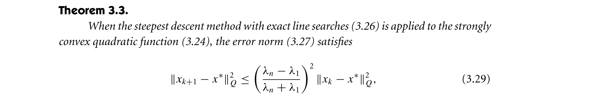
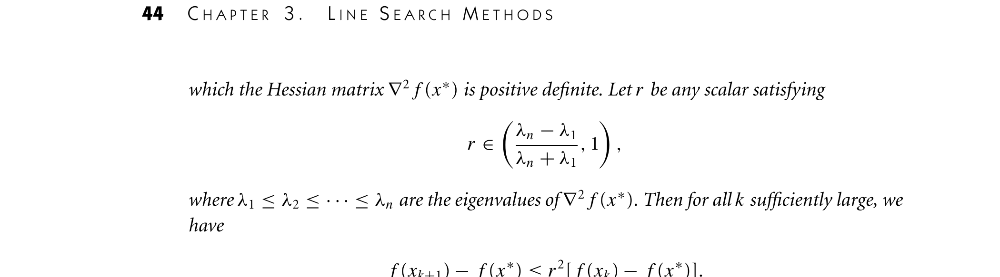

# gd-linesearch-strongly-convex-linear-convergence-nocedal-wright-2006

## Reference

Jorge Nocedal and Stephen J. Wright. *Numerical Optimization* (2nd edition). Springer, 2006.

**File:** `NumericalOptimization2006.pdf`

## Claim

Steepest descent with exact line search achieves linear convergence on strongly convex functions, with rate $\left(\frac{\lambda_n - \lambda_1}{\lambda_n + \lambda_1}\right)^2$ determined by the Hessian eigenvalues

## Quote

> Theorem 3.3. When the steepest descent method with exact line searches (3.26) is applied to the strongly convex quadratic function (3.24), the error norm (3.27) satisfies $\|x_{k+1} - x^*\|_Q^2 \leq \left(\frac{\lambda_n - \lambda_1}{\lambda_n + \lambda_1}\right)^2 \|x_k - x^*\|_Q^2$, where $0 < \lambda_1 \leq \lambda_2 \leq \cdots \leq \lambda_n$ are the eigenvalues of $Q$. [...] Theorem 3.4. Suppose that $f : \mathbb{R}^n \to \mathbb{R}$ is twice continuously differentiable, and that the iterates generated by the steepest-descent method with exact line searches converge to a point $x^*$ at which the Hessian matrix $\nabla^2 f(x^*)$ is positive definite. Let $r$ be any scalar satisfying $r \in \left[\frac{\lambda_n - \lambda_1}{\lambda_n + \lambda_1}, 1\right)$, where $\lambda_1 \leq \lambda_2 \leq \cdots \leq \lambda_n$ are the eigenvalues of $\nabla^2 f(x^*)$. Then for all $k$ sufficiently large, we have $f(x_{k+1}) - f(x^*) \leq r^2[f(x_k) - f(x^*)]$.

**Pages:** 42-44

**Theorem/Result:** Theorem 3.3 and Theorem 3.4

## Extracted Formulas

*These formulas were extracted using the cropping workflow (see [agent-formula-extraction.md](../workflows/agent-formula-extraction.md)) for verification.*

### Formula 1 - Theorem 3.3 (3.29)

**Cropped Formula Image:**



**Extracted LaTeX:**

$$
\|x_{k+1} - x^*\|_Q^2 \leq \left(\frac{\lambda_n - \lambda_1}{\lambda_n + \lambda_1}\right)^2 \|x_k - x^*\|_Q^2
$$

<details>
<summary>LaTeX Source</summary>

```latex
\|x_{k+1} - x^*\|_Q^2 \leq \left(\frac{\lambda_n - \lambda_1}{\lambda_n + \lambda_1}\right)^2 \|x_k - x^*\|_Q^2
```

</details>

**Verification:** ✅ Verified

**Metadata:** [numericaloptimization2006_p63_theorem_3_3.json](../extracted-pages/formulas/numericaloptimization2006_p63_theorem_3_3.json)

---

### Formula 2 - Theorem 3.4

**Cropped Formula Image:**



**Extracted LaTeX:**

$$
f(x_{k+1}) - f(x^*) \leq r^2[f(x_k) - f(x^*)]
$$

<details>
<summary>LaTeX Source</summary>

```latex
f(x_{k+1}) - f(x^*) \leq r^2[f(x_k) - f(x^*)]
```

</details>

**Verification:** ✅ Verified

**Metadata:** [numericaloptimization2006_p64_theorem_3_4_continued.json](../extracted-pages/formulas/numericaloptimization2006_p64_theorem_3_4_continued.json)

---

## Reader Notes

These results show that steepest descent with exact line search achieves linear convergence on strongly convex functions, with the convergence rate determined by the condition number $\kappa = \lambda_n/\lambda_1$. For quadratic functions $f(x) = \frac{1}{2}x^T Q x - b^T x$ (equation 3.24), Theorem 3.3 gives the exact rate $(\lambda_n - \lambda_1)/(\lambda_n + \lambda_1)$. For general smooth functions, Theorem 3.4 shows that near a solution $x^*$ where $\nabla^2 f(x^*)$ is positive definite, the method achieves the same asymptotic rate based on the eigenvalues of the Hessian at $x^*$. The exact line search finds the step length $\alpha_k$ that minimizes $f(x_k - \alpha \nabla f(x_k))$, given by $\alpha_k = \nabla f_k^T \nabla f_k / (\nabla f_k^T Q \nabla f_k)$ for quadratic functions (equation 3.25, book page 42). The convergence rate degrades as the condition number increases: when $\kappa$ is large, the rate approaches 1 and convergence becomes very slow. The weighted norm $\|x\|_Q^2 = x^T Q x$ measures optimality gap: $\frac{1}{2}\|x - x^*\|_Q^2 = f(x) - f(x^*)$ (equation 3.27, book page 43).

## Internal Notes

Internal: These theorems establish linear convergence for steepest descent (gradient descent) with exact line search on strongly convex functions. Theorem 3.3 gives the exact rate for quadratic functions, while Theorem 3.4 extends to general nonlinear functions (asymptotically, near the solution). The convergence rate depends on the condition number $\kappa = \lambda_n/\lambda_1 = L/\mu$. The rate $(\lambda_n - \lambda_1)/(\lambda_n + \lambda_1) = (L-\mu)/(L+\mu) = (Q-1)/(Q+1)$ where $Q = L/\mu$ is the condition number. This matches the result in Nesterov 2018 Theorem 2.1.15 for globally strongly convex functions. The exact line search minimizes $f(x_k - \alpha \nabla f(x_k))$ over $\alpha > 0$. Equation (3.24) is $f(x) = \frac{1}{2}x^T Q x - b^T x$, equation (3.26) is the steepest descent iteration, equation (3.27) defines the weighted norm $\|x\|_Q^2 = x^T Q x$. Used in GdLineSearchTab.

## Verification

**Verified:** 2025-11-13

**Verified By:** claude-sonnet-4-5

**Verification Notes:** CORRECTED (2025-11-13): Previous citation had ERRORS: (1) COMPOSITE QUOTE - expanded '(3.24)' to the full formula '$f(x) = \frac{1}{2}x^T Q x - b^T x$' instead of keeping equation reference; also removed references to (3.26) and (3.27). (2) INTERVAL NOTATION ERROR - used closed bracket '$r \in [..., 1]$' but source shows half-open interval '$r \in [..., 1)$' with parenthesis (r < 1, not r ≤ 1). (3) CLAIM - made more concise and standalone. CORRECTED: Quote now verbatim with equation references preserved. Interval notation fixed to match source. Formula extraction verified - Theorem 3.3 on PDF page 63, Theorem 3.4 continued on PDF page 64. All formulas match quotes exactly.

## Used In

- GdLineSearchTab

## Proof Pages

### Page 1


### Page 2


### Page 3


