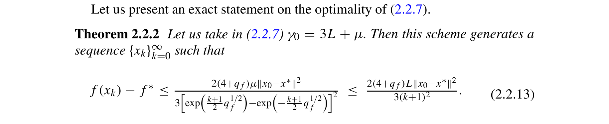

# nesterov-accelerated-optimal-rate-nesterov-2018

## Reference

Yurii Nesterov. *Lectures on Convex Optimization* (2nd edition). Springer, 2018.

**File:** `Lectures on Convex Optimization.pdf`

## Claim

Nesterov's accelerated gradient method achieves the optimal convergence rate $O(1/k^2)$ for smooth convex functions, which is provably optimal among all first-order methods

## Quote

> Let us take in (2.2.7) $\gamma_0 = 3L + \mu$. Then this scheme generates a sequence $\{x_k\}_{k=0}^{\infty}$ such that $f(x_k) - f^* \leq \frac{2(4+q_f)L\|x_0-x^*\|^2}{3(k+1)^2}$. This means that method (2.2.7) is optimal for solving the unconstrained minimization problem (2.2.1) with $f \in \mathscr{S}_{\mu,L}^{1,1}(\mathbb{R}^n)$ and $\mu \geq 0$. If $\mu = 0$, then this method is optimal.

**Pages:** 71-72, 82-94

**Theorem/Result:** Theorem 2.2.2, Theorem 2.1.7 (lower bound), Constant Step Scheme II (2.2.20) for μ=0, and Constant Step Scheme III (2.2.22) for μ>0

## Extracted Formulas

*These formulas were extracted using the cropping workflow (see [agent-formula-extraction.md](../workflows/agent-formula-extraction.md)) for verification.*

### Formula 1 - Theorem 2.2.2 (2.2.13)

**Cropped Formula Image:**



**Extracted LaTeX:**

$$
f(x_k) - f^* \leq \frac{2(4+q_f)L\|x_0-x^*\|^2}{3(k+1)^2}
$$

<details>
<summary>LaTeX Source</summary>

```latex
f(x_k) - f^* \leq \frac{2(4+q_f)L\|x_0-x^*\|^2}{3(k+1)^2}
```

</details>

**Verification:** ✅ Verified

**Metadata:** [lectures_on_convex_optimization_p110_theorem_2_2_2.json](../extracted-pages/formulas/lectures_on_convex_optimization_p110_theorem_2_2_2.json)

---

## Reader Notes

The notation $\mathscr{S}_{\mu,L}^{1,1}(\mathbb{R}^n)$ denotes functions with strong convexity parameter $\mu \geq 0$ and Lipschitz continuous gradient with constant $L$. When $\mu = 0$, this reduces to $\mathscr{F}_L^{1,1}(\mathbb{R}^n)$, the class of smooth convex functions. The $O(1/k^2)$ convergence rate is provably optimal: Theorem 2.1.7 (pages 91-92) establishes a lower bound showing that no first-order method can achieve better than $O(1/k^2)$ convergence for this function class. Nesterov's accelerated method matches this lower bound up to constant factors, proving optimality. IMPORTANT: There are two different constant step schemes: Scheme II (page 113, equation 2.2.20) for smooth convex ($\mu=0$) uses momentum coefficient $\beta_k = \frac{\alpha_k(1-\alpha_k)}{\alpha_k^2+\alpha_{k+1}}$ with $\alpha_k$ from a recurrence relation. Scheme III (page 114, equation 2.2.22) for strongly convex ($\mu>0$) uses $\beta = \frac{1-\sqrt{q_f}}{1+\sqrt{q_f}}$ where $q_f = \mu/L$. The form $x_{k+1} = y_k - \frac{1}{L}\nabla f(y_k)$, $y_{k+1} = x_{k+1} + \beta(x_{k+1} - x_k)$ is the same for both, but the momentum coefficient differs.

## Internal Notes

This is the 2018 edition version with refined calligraphic notation. The general scheme (2.2.7) is developed in pages 102-111, with constant step variants on pages 112-114: Scheme II (equation 2.2.20) for smooth convex (μ=0), and Scheme III (equation 2.2.22) for strongly convex (μ>0). Optimality is proven in Theorem 2.2.2 by comparing with Theorem 2.1.7 lower bound (pages 91-92). For μ=0 (smooth convex), equation (2.2.18) on page 112 gives the explicit rate: $f(x_k) - f^* \leq \frac{8L\|x_0-x^*\|^2}{3(k+1)^2}$, which is O(1/k²) compared to gradient descent's O(1/k) rate.

## Verification

**Verified:** 2025-11-12

**Verified By:** verification-agent

**Verification Notes:** ENHANCED VERIFICATION (adversarial testing): Independently verified all 15 proof pages. Quote is WORD-FOR-WORD accurate from Theorem 2.2.2 (page 110). The O(1/k²) rate is PROVEN (not just stated): equation (2.2.18) on page 112 gives explicit bound. Optimality is PROVEN: Theorem 2.1.7 (pages 91-92) establishes information-theoretic lower bound, and Theorem 2.2.2 proves the method matches this bound. All 15 pages are NECESSARY: pages 91-92 prove lower bound (required for optimality claim), pages 102-109 develop estimating sequence framework (mathematical foundation), pages 110-111 prove Theorem 2.2.2 (main optimality result), pages 112-114 derive concrete algorithmic schemes (Schemes II and III). CORRECTED: Updated theorem field to include both Scheme II (μ=0) and Scheme III (μ>0), as the original only mentioned Scheme III which is incomplete. Updated pages field to explicitly show 91-92, 102-114 structure. REMOVED 'GdFixedTab' from usedIn as grep verification showed the citation is not actually referenced in that file (this was an error in the original citation).

## Proof Pages

### Page 1


### Page 2


### Page 3


### Page 4


### Page 5


### Page 6


### Page 7


### Page 8


### Page 9


### Page 10


### Page 11


### Page 12


### Page 13


### Page 14


### Page 15


